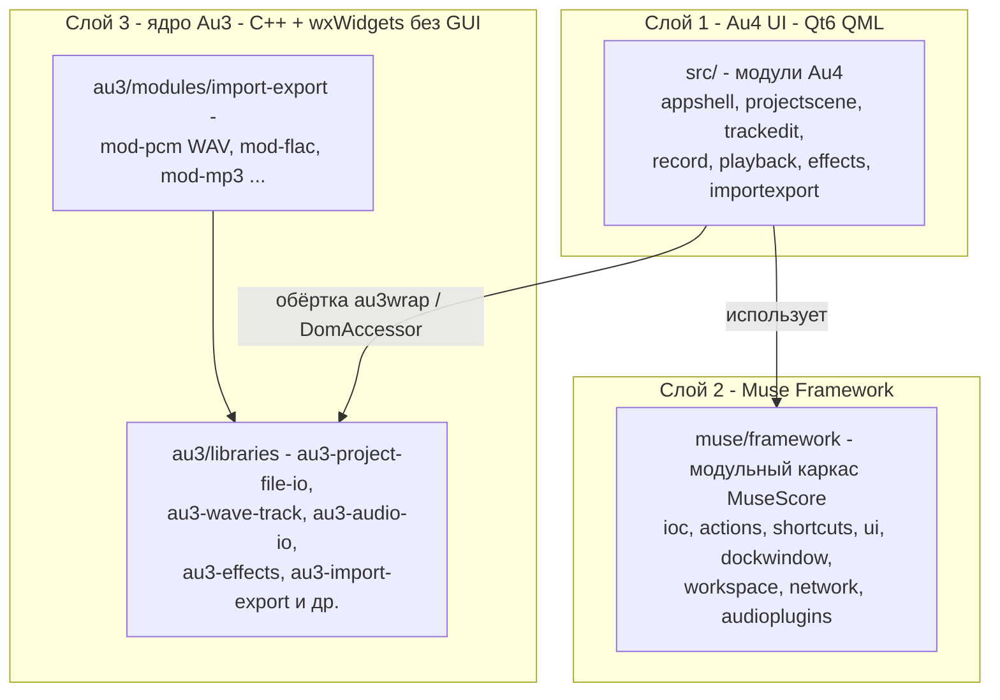

# Анализ кодовой базы Audacity 4.0 (форк RuDub Studio)

Дата: 2026-09-14, ревизия 2 (закрыты замечания 1–3 к первой версии)
Статус: ШАГ 1 (АНАЛИЗ) принят как база. Замечания закрыты: §5 — схема регистрации
эффектов переснята дословно с учётом ревампа audio plugins; §7 — добавлены дословные
цитаты CMakeLists о несобираемости au3/src и au3-menus; §0 — точный путь фреймворка
подтверждён цитатой из корневого CMakeLists. ШАГ 2 — docs/plans/architecture.md,
ШАГ 3 — docs/plans/roadmap.md.
База: тег Audacity-4.0.0, рабочая копия `d:/auda/audacity`.

---

## 0. Общая архитектура репозитория

Audacity 4 — это гибридное приложение из трёх слоёв:



| Каталог | Роль | Ссылка |
|---|---|---|
| `src/` | Новые модули Au4: QML-интерфейс, view-модели, сценарии | [`src/app/appfactory.cpp`](../../src/app/appfactory.cpp) — полный список модулей приложения |
| `muse/` | Каркас MuseScore (модульность, IOC, actions, докинг, настройки) | [`muse/framework/`](../../muse/framework) |
| `au3/libraries/` | Ядро обработки аудио из Audacity 3, собранное без wx-GUI | [`au3/libraries/CMakeLists.txt`](../../au3/libraries/CMakeLists.txt) |
| `au3/src/` | Легаси wx-приложение Au3. **НЕ собирается** в AU4 (в т.ч. BatchCommands/Macros) | [`au3/src/CMakeLists.txt`](../../au3/src/CMakeLists.txt) — target `Audacity`, не подключён к корневой сборке |
| `au3/modules/import-export/` | Статические плагины форматов импорта (WAV = `mod-pcm`) | [`au3/modules/import-export/CMakeLists.txt`](../../au3/modules/import-export/CMakeLists.txt) |
| `muse_deps/` | Рецепты и прекомпилированные зависимости (PortAudio, ASIO SDK и др.) | [`muse_deps/prebuilt.lock`](../../muse_deps/prebuilt.lock) |

Ключевой файл сборки: [`CMakeLists.txt`](../../CMakeLists.txt) — в дерево сборки входят только `muse/framework`, `src`, `share`; au3 подключается изнутри [`src/au3wrap/CMakeLists.txt`](../../src/au3wrap/CMakeLists.txt).

**Точный путь фреймворка в рабочей копии — `muse/framework`** (не `muse_framework`). Дословно из корневого [`CMakeLists.txt:24-25`](../../CMakeLists.txt):

```cmake
set(MUSE_FRAMEWORK_PATH ${CMAKE_SOURCE_DIR}/muse)
set(MUSE_FRAMEWORK_SRC_PATH ${MUSE_FRAMEWORK_PATH}/framework)
```

и дословно [`CMakeLists.txt:205-207`](../../CMakeLists.txt) — полное дерево сборки:

```cmake
add_subdirectory(${MUSE_FRAMEWORK_SRC_PATH})
add_subdirectory(src)
add_subdirectory(share)
```

---

## 1. Формат файла проекта: .aup3 = SQLite — СОХРАНЁН

**Вывод: контейнер .aup3 (SQLite) полностью сохранён**, "new clip-editing model" не изменил формат хранилища.

Файлы:
- [`au3/libraries/au3-project-file-io/ProjectFileIO.h`](../../au3/libraries/au3-project-file-io/ProjectFileIO.h) — класс `ProjectFileIO`: `LoadProject`, `SaveProject`, `SaveCopy`, `AutoSave`, `AutoSaveDelete`; внутри `struct sqlite3`, таблицы sample-blocks + project-документ (XML-сериализация).
- [`au3/libraries/au3-project-file-io/DBConnection.cpp`](../../au3/libraries/au3-project-file-io/DBConnection.cpp) — соединение с SQLite, wal-режим.
- [`au3/libraries/au3-project-file-io/SqliteSampleBlock.cpp`](../../au3/libraries/au3-project-file-io/SqliteSampleBlock.cpp) — аудиосэмплы в блобах БД (audacity::project::sample_blocks).
- [`au3/libraries/au3-project-file-io/ProjectSerializer.cpp`](../../au3/libraries/au3-project-file-io/ProjectSerializer.cpp) — бинарная сериализация XML-документа проекта в БД.
- **Точка расширения для типа "Дубляж"**: [`au3/libraries/au3-project-file-io/ProjectFileIOExtension.h`](../../au3/libraries/au3-project-file-io/ProjectFileIOExtension.h) — интерфейс, через который сторонние подсистемы дописывают свои данные в тот же .aup3 при сохранении/автосейве. Это штатный механизм, куда можно записывать метаданные реплик, историю текстов, журнал заданий и маппинг персонажей — без изменения формата и с переносимостью на другой ПК одним файлом.

Обёртка Au4: [`src/au3wrap/internal/au3project.cpp`](../../src/au3wrap/internal/au3project.cpp), интерфейс [`src/au3wrap/iau3project.h`](../../src/au3wrap/iau3project.h) (`load`, `save`, `hasAutosaveData`, `removeAutosaveData`, `isRecovered`).

Автосохранение и восстановление: [`src/project/internal/projectautosaver.cpp`](../../src/project/internal/projectautosaver.cpp) — QTimer, интервал настраивается; **по умолчанию включён и равен 5 минутам** ([`src/project/internal/projectconfiguration.cpp:29-38`](../../src/project/internal/projectconfiguration.cpp)), сохранение только при `needAutoSave()` (т.е. только при изменениях). Восстановление после сбоя — через `isRecovered()`/autosave-данные в .aup3.

---

## 2. Модель WaveTrack / WaveClip после "new clip-editing model"

Ядро (au3):
- [`au3/libraries/au3-wave-track/WaveTrack.h`](../../au3/libraries/au3-wave-track/WaveTrack.h) — `WaveTrack : PlayableSequence`, содержит клипы (`WaveClipHolders`), каналы, `GetClipAtTime` и пр.
- [`au3/libraries/au3-wave-track/WaveClip.h`](../../au3/libraries/au3-wave-track/WaveClip.h) — `WaveClip : ClipInterface`, `WaveClipChannel`, огибающая (`Envelope`), `Sequence` + `SampleBlock` (сэмплы живут в SQLite), растяжение (stretch ratio) без изменения тона, `PlayRegion`.
- [`au3/libraries/au3-wave-track/SampleBlock.h`](../../au3/libraries/au3-wave-track/SampleBlock.h) — блоки сэмплов (18 блоков ~ по умолчанию 64КБ).

Модель Au4 (как ссылаться из нового кода):
- Идентификаторы: [`src/trackedit/trackedittypes.h:20-50`](../../src/trackedit/trackedittypes.h) — `TrackId = int64_t`, `ClipId = int64_t`, `ClipKey {trackId, itemId}` (сравнимы, валидируемы).
- DOM-структуры: [`src/trackedit/dom/track.h`](../../src/trackedit/dom/track.h) (`Track: id, title, type, format, rate, solo, mute`), [`src/trackedit/dom/clip.h`](../../src/trackedit/dom/clip.h) (`Clip: key, clipVersion, title, colorIndex, groupId, startTime, endTime, stereo, pitch, speed, optimizeForVoice, stretchToMatchTempo`).
- Доступ к au3-объектам: [`src/au3wrap/internal/domaccessor.h`](../../src/au3wrap/internal/domaccessor.h) — `DomAccessor::findWaveTrack(prj, trackId)`, `findWaveClip(track, clipId)`, `findWaveClip(prj, trackId, time)`, `waveClipsAsList(track)`; конвертация DOM: `domconverter.h`.
- **Именно так внешний код ссылается на клип: пара (TrackId, ClipId) -> DomAccessor -> std::shared_ptr<Au3WaveClip>.**

Undo/Redo: [`src/trackedit/iprojecthistory.h`](../../src/trackedit/iprojecthistory.h) (`IProjectHistory: undo, redo, pushHistoryState, undoRedoToIndex, modifyState, startUserInteraction/endUserInteraction`) поверх au3 `ProjectHistory` + UndoStack. Все изменения проекта должны идти через `ITrackeditInteraction`/`pushHistoryState` — параллельный механизм отмены запрещён (см. AGENTS.md §5).

---

## 3. UI-стек: Qt 6 QML (НЕ Qt Widgets), докинг — Muse.Dock

- GUI целиком на **Qt Quick / QML** (`QtQuick`, `QtQuick.Controls`), см. [`src/app/main.cpp`](../../src/app/main.cpp) и [`src/appshell/qml/Audacity/AppShell/AppWindow.qml`](../../src/appshell/qml/Audacity/AppShell/AppWindow.qml).
- wxWidgets остаётся только внутри au3-библиотек как неболтающаяся зависимость не-GUI частей (wxBase, [`au3/libraries/CMakeLists.txt:9-22`](../../au3/libraries/CMakeLists.txt)).
- **Докинг панелей**: модуль [`muse/framework/dockwindow/`](../../muse/framework/dockwindow) (QML-типы `DockPage`, `DockPanel`, `DockToolBar`, `DockCentralView`; C++ `dockpageview`, `dockpanelview`). Внутри — встроенный форк KDDockWidgets (GPL-3.0): [`muse/framework/dockwindow/thirdparty/KDDockWidgets/`](../../muse/framework/dockwindow/thirdparty/KDDockWidgets).
- **Где регистрируются панели**: страница главного окна проекта — [`src/appshell/qml/Audacity/AppShell/ProjectPage/ProjectPage.qml`](../../src/appshell/qml/Audacity/AppShell/ProjectPage/ProjectPage.qml): `DockPage { uri: "audacity://project" ... mainToolBars: [DockToolBar...] ... }` с секциями навигации Top/Left/Right/Bottom/Central. Новая панель = `DockPanel` в этом файле + QML-файл панели + view-модель C++ + регистрация в списке панелей (см., например, как подключена панель эффектов: `tracksPanel.showEffectsSection`).
- **Регистрация модуля приложения**: [`src/app/appfactory.cpp:164-191`](../../src/app/appfactory.cpp) — `app->addModule(new au::<module>::<Module>())`. Новый модуль = свой каталог в `src/` + строка здесь.
- Хоткеи и команды: muse `framework/actions` (`IActionsDispatcher`, dispatch по коду действия) + `framework/shortcuts` (переназначение хоткеев, импорт/экспорт раскладок). Пример объявления действий: [`src/trackedit/internal/trackedituiactions.h`](../../src/trackedit/internal/trackedituiactions.h) (`muse::ui::UiActionList`).
- Запоминание раскладки панелей: muse `framework/workspace` (WorkspaceModule включён, см. [`CMakeLists.txt:137`](../../CMakeLists.txt)).
- Темы: muse `framework/draw`; тёмная тема входит в комплект (выбор темы в FirstLaunchSetup/Preferences).

---

## 4. Аудио backend: PortAudio сохранён, ASIO подключается автоматически

- **PortAudio v19.7.0** собирается из исходников через систему зависимостей muse_deps: [`muse_deps/recipes/portaudio/spec.cmake`](../../muse_deps/recipes/portaudio/spec.cmake). С патчами: ленивое перечисление ASIO-устройств и экспорты для PortMixer ([`0002-asio-lazy-device-enumeration.patch`](../../muse_deps/recipes/portaudio/patch/0002-asio-lazy-device-enumeration.patch)).
- **ASIO SDK 2.3.4** скачивается той же системой: [`muse_deps/recipes/asiosdk/spec.cmake`](../../muse_deps/recipes/asiosdk/spec.cmake) (zip с musescore/muse_deps), включается `-DPA_USE_ASIO=ON` в [`muse_deps/recipes/portaudio/build.cmake`](../../muse_deps/recipes/portaudio/build.cmake). **Отдельно скачивать Steinberg SDK и править CMake не требуется** — всё уже в репозитории.
- Ядро аудио I/O: [`au3/libraries/au3-audio-io/AudioIO.h`](../../au3/libraries/au3-audio-io/AudioIO.h) (`StartPortAudioStream`, callback-поток, RingBuffer), устройства: [`au3/libraries/au3-audio-devices/DeviceManager.cpp`](../../au3/libraries/au3-audio-devices/DeviceManager.cpp) (`GetInputDeviceMaps`, `ShowAsioControlPanel`, `UpdateAsioDeviceCaps`).
- Обёртка Au4: [`src/au3audio/internal/au3audiodrivercontroller.cpp`](../../src/au3audio/internal/au3audiodrivercontroller.cpp) — приоритет API на Windows: `{ "Windows WASAPI", "ASIO", "Windows DirectSound", "MME" }` (строка 55); настройки `AudioIO/ASIO/UseDeviceSampleRate`; настройка частоты дискретизации проекта (`DEFAULT_PROJECT_SAMPLE_RATE`, `AudioIOBase::GetOptimalSupportedSampleRate()`).
- UI настроек ASIO: [`src/preferences/qml/Audacity/Preferences/internal/AsioSection.qml`](../../src/preferences/qml/Audacity/Preferences/internal/AsioSection.qml) (использовать частоту устройства, кнопка панели драйвера ASIO).
- Запись: [`src/record/internal/au3/au3record.cpp`](../../src/record/internal/au3/au3record.cpp) — выбор входных каналов, «punch»-точка, **тейки**: комментарий «The pending track is an empty copy of the original, so the take number must be resolved against the original track's clips» (строки 709-711) — запись с повторами уже оперирует понятием тейка. Мониторинг входа управляется настройками audio/record (software playthrough), программное включение возможно через AudioIO API.
- Пробелы: блокировка референсной дорожки «только mute/solo» как user-facing режим в Au4 отсутствует (в `src/trackedit` блокировок трека нет — только внутренний `projecteditstate.h` lock редактирования) — нужен свой флаг/фильтр взаимодействий.

---

## 5. Эффекты: дословная схема регистрации на теге Audacity-4.0.0 (ревизия 2)

### 5.1 Ядро механизма — `BuiltinEffectsModule::Registration<T>`

Дословно из [`au3/libraries/au3-effects/LoadEffects.h:29-47`](../../au3/libraries/au3-effects/LoadEffects.h):

```cpp
class EFFECTS_API BuiltinEffectsModule final : public PluginProvider
{
public:
    BuiltinEffectsModule();
    virtual ~BuiltinEffectsModule();

    using Factory = std::function< std::unique_ptr<Effect>() >;

    // Typically you make a static object of this type in the .cpp file that
    // also implements the Effect subclass.
    template< typename Subclass >
    struct Registration final {
        Registration(bool excluded = false)
        {
            DoRegistration(
                Subclass::Symbol, []{ return std::make_unique< Subclass >(); },
                excluded);
        }
    };
```

Все регистрации встроенных эффектов Au4 собраны в одном месте — [`src/effects/builtin_collection/internal/builtincollectionloader.cpp:80-91`](../../src/effects/builtin_collection/internal/builtincollectionloader.cpp). Дословно (начало):

```cpp
void BuiltinCollectionLoader::preInit()
{
    static BuiltinEffectsModule::Registration< FadeInEffect > regFadeIn;
    static BuiltinEffectsModule::Registration< FadeOutEffect > regFadeOut;
    static BuiltinEffectsModule::Registration< InvertEffect > regInvert;
    static BuiltinEffectsModule::Registration< Repair > regRepair;
    static BuiltinEffectsModule::Registration< ReverseEffect > regReverse;
    static BuiltinEffectsModule::Registration< TruncateSilenceEffect > regTruncateSilence;
#if USE_SOUNDTOUCH
    static BuiltinEffectsModule::Registration< ChangePitchEffect > regChangePitch;
#endif
    static BuiltinEffectsModule::Registration< AmplifyEffect > regAmplify;
```

Вызов `preInit()` — из модуля коллекции, дословно [`src/effects/builtin_collection/builtineffectscollectionmodule.cpp:44-51`](../../src/effects/builtin_collection/builtineffectscollectionmodule.cpp):

```cpp
void BuiltinEffectsCollectionModule::onPreInit(const muse::IApplication::RunMode&)
{
    //! NOTE preInit() only creates static Registration objects (doesn't use `this`).
    //! Must run at module level before Au3WrapModule::onInit() sets sInitialized = true.
    BuiltinCollectionLoader::preInit();

    m_builtinCollectionLoader = std::make_unique<BuiltinCollectionLoader>(muse::modularity::globalCtx());
}
```

### 5.2 Ревамп audio plugins: встраивание в реестры muse

После ревампа встроенные эффекты — полноценные участники единого конвейера плагинов muse. Модуль `effects_builtin` регистрирует сканер, метаридер и лоадер в три реестра. Дословно [`src/effects/builtin/builtineffectsmodule.cpp:41-57`](../../src/effects/builtin/builtineffectsmodule.cpp):

```cpp
void BuiltinEffectsModule::resolveImports()
{
    const auto scannerRegister = globalIoc()->resolve<muse::audioplugins::IAudioPluginsScannerRegister>(moduleName());
    if (scannerRegister) {
        scannerRegister->registerScanner(m_pluginsScanner);
    }

    const auto metaReaderRegister = globalIoc()->resolve<muse::audioplugins::IAudioPluginMetaReaderRegister>(moduleName());
    if (metaReaderRegister) {
        metaReaderRegister->registerReader(m_metaReader);
    }

    auto loadersRegister = globalIoc()->resolve<IEffectLoadersRegister>(moduleName());
    if (loadersRegister) {
        loadersRegister->registerLoader(m_effectLoader);
    }
}
```

Сканер/метаридер уходят в `muse/framework/audioplugins` (реестры `IAudioPluginsScannerRegister`, `IAudioPluginMetaReaderRegister`), лоадер — в `IEffectLoadersRegister` из `src/effects/effects_base`. Программное выполнение зарегистрированного эффекта (нужно для 6.10) — [`src/effects/effects_base/ieffectexecutionscenario.h:23-24`](../../src/effects/effects_base/ieffectexecutionscenario.h):

```cpp
virtual muse::Ret performEffect(const EffectId& effectId) = 0;
virtual muse::Ret performEffect(const EffectId& effectId, const std::string& params) = 0;
```

### 5.3 Минимальный живой пример без UI — Fade

Ядро целиком в [`src/effects/builtin_collection/fade/`](../../src/effects/builtin_collection/fade): `FadeEffectBase : StatefulPerTrackEffect` с `ProcessBlock` и статическим символом ([fadeeffect.h:6,32-35](../../src/effects/builtin_collection/fade/fadeeffect.h)). Дословно определение символа ([fadeeffect.cpp:64](../../src/effects/builtin_collection/fade/fadeeffect.cpp)):

```cpp
const ComponentInterfaceSymbol FadeInEffect::Symbol { TranslatableString("effects-fade", "Fade In") };
```

Регистрация — одна строка из §5.1 (`regFadeIn`). QML не требуется: `IsInteractive()` возвращает `false`, view-URL не регистрируется.

### 5.4 Минимальный живой пример с QML — Amplify

- Ядро: `AmplifyEffect : StatefulPerTrackEffect`, [`src/effects/builtin_collection/amplify/amplifyeffect.h:11`](../../src/effects/builtin_collection/amplify/amplifyeffect.h), с блоком свойств «fot view» (`inputPeak`, `amp`, `newPeak`, `canClip`, `isApplyAllowed`) и `static const ComponentInterfaceSymbol Symbol`.
- View-модель: `AmplifyViewModel : BuiltinEffectModel` и фабрика — дословно [`src/effects/builtin_collection/amplify/amplifyviewmodel.h:75-77`](../../src/effects/builtin_collection/amplify/amplifyviewmodel.h):

```cpp
class AmplifyViewModelFactory : public EffectViewModelFactory<AmplifyViewModel>
{
};
```

- QML: [`src/effects/builtin_collection/amplify/AmplifyView.qml:7,17-18`](../../src/effects/builtin_collection/amplify/AmplifyView.qml) — дословно:

```qml
BuiltinEffectBase {
    id: root
    ...
    builtinEffectModel: AmplifyViewModelFactory.createModel(root, root.instanceId)
    property alias amplify: root.builtinEffectModel
```

- Привязка QML к символу эффекта — в `BuiltinCollectionLoader::init()`, дословно [`builtincollectionloader.cpp:114-119`](../../src/effects/builtin_collection/internal/builtincollectionloader.cpp):

```cpp
auto regView = [this](const ::ComponentInterfaceSymbol& symbol, const muse::String& url) {
    builtinEffectsViewRegister()->regUrl(au3::wxToString(symbol.Internal()), url);
};

REGISTER_AUDACITY_EFFECTS_SINGLETON_TYPE(AmplifyViewModelFactory);
regView(AmplifyEffect::Symbol, u"qrc:/amplify/AmplifyView.qml");
```

Показ view — через лаунчер, дословно [`builtineffectscollectionmodule.cpp:76-82`](../../src/effects/builtin_collection/builtineffectscollectionmodule.cpp):

```cpp
void BuiltinEffectsCollectionContext::resolveImports()
{
    auto lr = ioc()->resolve<IEffectViewLaunchRegister>(mname);
    if (lr) {
        lr->regLauncher(EffectFamily::Builtin, std::make_shared<BuiltinViewLauncher>(iocContext()));
    }
}
```

### 5.5 Разделение кода эффектов

- `au3/libraries/au3-builtin-effects` — переносимые базовые классы `*Base` (`SilenceBase`, `ChangePitchBase`, `SBSMSBase`, `SoundTouchBase`, `FindClippingBase`, `ToneGenBase`, `TruncSilenceBase` и др.).
- `src/effects/builtin_collection/<имя>/` — итоговые классы эффектов Au4 (+ viewmodel + QML); часть эффектов (fade, amplify) реализована здесь целиком, без Base-класса.
- VST3/Nyquist/LV2/AudioUnit — отдельные модули (`src/effects/vst` и т.д.).
- Рецепт нового эффекта дубляжа: ядро-класс au3-стиля + статическая `Registration<T>` в `preInit()` своего лоадера + QML-view через `regUrl` — по образцу §5.3 (без UI) или §5.4 (с UI).

Растяжение времени без изменения тона: SBSMS и SoundTouch включены (`AU_USE_SBSMS`, `AU_USE_SOUNDTOUCH`, [`CMakeLists.txt:100-101`](../../CMakeLists.txt)); эффекты ChangePitch/ChangeTempo/SlidingStretch (`src/effects/builtin_collection/slidingstretch/`), у клипа есть `speed`/`stretchToMatchTempo` — основа для «Подогнать под референс».

---

## 6. Штатный импорт WAV: годен как блок, массового импорта по guid НЕТ

- Импорт одного файла: [`src/importexport/import/internal/au3/au3importer.cpp`](../../src/importexport/import/internal/au3/au3importer.cpp) — `import(filePath)`, **`importIntoTrack(filePath, dstTrackId, startTime)`** (импорт в существующую дорожку в заданную позицию — ключевой строительный блок), `importFromSystemClipboard(filePaths, startTime)` (уже принимает список путей). Форматный плагин WAV: `au3/modules/import-export/mod-pcm` (PCM через libsndfile 1.2.2).
- Механизм выбора плагинов: `Importer::Import` ([`au3/libraries/au3-import-export/Import.h`](../../au3/libraries/au3-import-export/Import.h)), `TrackHolders` — результат импорта (созданные дорожки).
- **Чего нет**: сопоставления файлов с внешними метаданными (guid), пакетного неблокирующего импорта тысяч файлов с прогрессом/логом/продолжением, сверки длительности с ожидаемой, инкрементального повторного импорта без потери работы. Всё это — писать свой сервис поверх `Au3Importer::importIntoTrack` (сами декодирование и создание дорожек переиспользуем, UI-диалоги штатного импорта отключаем).
- Длительность WAV до полного импорта можно читать напрямую (libsndfile/собственный парсер заголовка) для предварительной сверки с `dur` из JSON.

---

## 7. CommandManager и Macros в 4.0: НЕ АКТУАЛЬНЫ — дословные доказательства из CMakeLists

**а) корневая сборка не включает `au3/` вообще** — в дереве только фреймворк, src и share. Дословно [`CMakeLists.txt:205-207`](../../CMakeLists.txt):

```cmake
add_subdirectory(${MUSE_FRAMEWORK_SRC_PATH})
add_subdirectory(src)
add_subdirectory(share)
```

**б) au3 попадает в сборку AU4 только через au3wrap, и только `libraries` + `modules/import-export`.** Дословно [`src/au3wrap/au3wrapDefs.cmake:22-23`](../../src/au3wrap/au3wrapDefs.cmake):

```cmake
set(AU3_LIBRARIES ${AUDACITY_ROOT}/libraries)
set(AU3_MODULES ${AUDACITY_ROOT}/modules)
```

и дословно [`src/au3wrap/CMakeLists.txt:84-89`](../../src/au3wrap/CMakeLists.txt):

```cmake
# Include AU3 libraries - this will add all library subdirectories
# and set AU3_LIBRARIES_LIST in this scope
add_subdirectory(${AU3_LIBRARIES} au3-libraries)

# AU3 import/export format plugins (per-format static libraries)
add_subdirectory(${AU3_MODULES}/import-export au3-import-export-modules)
```

Каталог `au3/src` (где живут [`au3/src/BatchCommands.h`](../../au3/src/BatchCommands.h) с `BatchCommands`/`MacroCommands`) не упоминается ни в одном `add_subdirectory` сборки AU4. Его собственный CMakeLists объявляет отдельный исполняемый target легаси-приложения — дословно [`au3/src/CMakeLists.txt:5-15`](../../au3/src/CMakeLists.txt):

```cmake
set( TARGET Audacity )
set( TARGET_ROOT ${topdir}/src )
...
add_executable( ${TARGET} )
```

**в) `au3-menus` (CommandManager) исключён из списка библиотек.** Дословно [`au3/libraries/CMakeLists.txt:78-80`](../../au3/libraries/CMakeLists.txt) — внутри упорядоченного списка `LIBRARIES`:

```cmake
   au3-stretching-sequence
#   au3-menus
#   au3-note-track # not yet used in AU4
```

(соседние исключённые строки помечены «not yet used in AU4», сама `au3-menus` — просто закомментирована).

**Следствия:** CommandManager, Macros/BatchCommands в AU4 недоступны и не могут быть «расширены своим шагом». Фактическая система команд Au4 — muse actions (`IActionsDispatcher`, `UiActionList`/`IUiActionsModule` + `framework/shortcuts`); движок пакетной обработки пишется с нуля (muse `framework/network` включён, `AU_USE_LIBCURL=OFF` по умолчанию, `QT_QPROCESS_SUPPORTED` — корневой [`CMakeLists.txt:167`](../../CMakeLists.txt)).
- Фактическая система команд Au4 — muse actions: `IActionsDispatcher`, `UiActionList`/`IUiActionsModule` + `framework/shortcuts` для хоткеев. Расширять «Macros своим шагом (внешний процесс/сетевой API)» нечем — **движок пакетной обработки пишется с нуля** (собственная очередь заданий + QProcess/QNetworkAccessManager; muse `framework/network` уже включён, `AU_USE_LIBCURL=OFF` по умолчанию).

---

## 8. Лицензии (все LICENSE-файлы репозитория)

| Файл | Лицензия | Следствие для форка |
|---|---|---|
| [`LICENSE.txt`](../../LICENSE.txt) (корень) | **GPLv3** для приложения; многие файлы доступны также под GPLv2+; документация CC-BY 3.0 | Форк обязан оставаться GPL; исходники модификаций должны предоставляться при распространении |
| [`muse/LICENSE.txt`](../../muse/LICENSE.txt) | **GPLv3** + MuseScore/Audacity CLA | Новые модули в стиле muse-файлов попадают под те же условия |
| [`muse/framework/dockwindow/thirdparty/KDDockWidgets/LICENSE.GPL.txt`](../../muse/framework/dockwindow/thirdparty/KDDockWidgets/LICENSE.GPL.txt) (+`LICENSES/`) | GPL-3.0-only (форк KDDockWidgets) | Использование уже легально внутри GPL-приложения; менять/выносить наружу нельзя без соблюдения GPL |
| [`src/effects/nyquist/libnyquist/LICENSE.txt`](../../src/effects/nyquist/libnyquist/LICENSE.txt) | BSD-style (Nyquist/nyx) | Совместимо |
| ASIO SDK 2.3.4 ([`muse_deps/recipes/asiosdk/spec.cmake`](../../muse_deps/recipes/asiosdk/spec.cmake)) | **Проприетарная лицензия Steinberg** | Сборку с ASIO нельзя распространять публично в бинарном виде — только личное использование (для нашей задачи ОК: форк для одного человека) |
| thirdparty/portmixer, pffft, ogg/flac/mp3 рецепты muse_deps | BSD/LGPL/MIT (permissive) | Совместимо с GPLv3 |

Итог: главные ограничения — (1) GPLv3 для производного кода при распространении; (2) запрет публичной дистрибуции ASIO-сборки. Для внутреннего использования одним человеком ограничений нет.

---

## 9. Стандарт C++, зависимости, процедура сборки

- **C++20** (`set(CMAKE_CXX_STANDARD 20)`, [`CMakeLists.txt:13`](../../CMakeLists.txt)). Указание в AGENTS.md «C++17» устарело — новый код пишем на C++20 (в рамках стиля кодовой базы).
- CMake >= 3.24; генератор Ninja; MSVC 2022 x64 (Windows); **Qt 6.10** (минимум по коду 6.2.4, фактически требуемая BUILDING.md — 6.10 MSVC 2022 64-bit) + модули: Qt 5 Compatibility, Network Authorization, Shader Tools, State Machines ([`BUILDING.md`](../../BUILDING.md)).
- Пресеты: `audacity-debug`, `audacity-asan`, `audacity-release` ([`CMakePresets.json`](../../CMakePresets.json)); VS-решение — `generate_sln.bat`; VSCode — workspace `.vscode/audacity.code-workspace` (F5).
- Зависимости: [`muse_deps/`](../../muse_deps) (manifest.cmake + prebuilt.lock): libsndfile 1.2.2, expat 2.7.1, flac 1.4.3, lame 3.100, mpg123 1.32.10, opus, vorbis, harfbuzz 12.3.0 и др.; PortAudio 19.7.0 и ASIO SDK 2.3.4 собираются из рецептов.
- Тесты: muse-тесты + per-module `AU_BUILD_*_TESTS` (ctest); в `src/` есть образцы тестов для подражания (например [`src/au3audio/tests/`](../../src/au3audio/tests), [`src/trackedit/tests/`](../../src/trackedit/tests)).

---

## 10. Итоговая таблица: Требование / Есть в коде / Расширить / Писать с нуля

| # | Требование (раздел 6 AGENTS.md) | Есть в коде (файл/класс) | Нужно расширить | Писать с нуля |
|---|---|---|---|---|
| 6.1 | Тип проекта «Дубляж», всё в одном файле | `ProjectFileIO` (SQLite .aup3); `ProjectFileIOExtension.h` — точка дописывания данных; `IAu3Project.load/save` | Да: свой `DubbingProjectFileIOExtension` + признак типа проекта + экран выбора типа при создании | Диалог создания проекта типа «Дубляж» |
| 6.2 | Модель данных, импорт JSON + WAV по guid | `Au3Importer::importIntoTrack` (импорт в дорожку в позицию); mod-pcm (WAV); libsndfile; QJsonDocument (Qt) в std | Да: чтение длительности без полного импорта | **Да: сервис массового импорта** (JSON-модель file→scene→line, сопоставление guid↔WAV из папки, сверка dur, статусы, инкрементальность, фон, прогресс, лог) |
| 6.3 | Панель списка реплик (десятки тысяч строк) | Muse.Dock (`DockPanel`, `DockPage`); QML-таблицы muse (uicomponents); workspace (запоминание) | Да: точку регистрации панели в `ProjectPage.qml` | **Да: сама панель** (виртуализированное дерево, фильтры, поиск, двойной клик) |
| 6.4 | Запись ASIO, моно; референс locked; мастер; тейки; мониторинг; sample rate | PortAudio+ASIO SDK (рецепты muse_deps, `PA_USE_ASIO=ON`); `Au3AudioDriverController` (ASIO, UseDeviceSampleRate); `au3record.cpp` (punch, тейки); sample rate проекта настраивается | Да: режим циклической записи «каждый повтор — новая дорожка-тейк»; программное управление мониторингом; преднастройка моно | **Да: флаг референсной дорожки** (запрет редактирования, только mute/solo) — в Au4 нет; концепция «мастер-дорожки» как именованной целевой дорожки |
| 6.5 | Автооценка тейков (громкость, клиппинг, длительность) | Аудиоанализ: `au3-wave-track-fft`, meter (`au3audiometer`), `FindClippingBase` | Да: снятие метрик с записанного клипа | **Да: индикатор годности в реальном времени + ручная маркировка + компоновка в мастер** |
| 6.6 | Редактирование | Обрезка/разделение/перемещение/фейды/кроссфейд/громкость/нормализация/тишина/реверс — есть (`trackedit`, `builtin_collection`: fade, reverse, normalize, amplify, silence…); тайм-стрейч без тона — SBSMS/SoundTouch, `Clip.speed/stretchToMatchTempo`, slidingstretch | Да: команды «Подогнать под референс» (стретч под длительность), «Выровнять по референсу» (привязка начала), «Отправить в мастер» (перенос + автокроссфейд) как операции trackedit через IProjectHistory | — |
| 6.7 | Надёжность: undo через перезапуск, автосейв 5 мин, восстановление | `IProjectHistory` + au3 UndoStack (undo-redo сохраняется в .aup3); `ProjectAutoSaver` (**вкл. по умолчанию, 5 мин**, только при изменениях); autosave/восстановление в .aup3 | Да: предложение восстановления со временем снимка при старте (частично есть — isRecovered-механизм Au3) | — |
| 6.8 | Экспорт мастер в WAV, имя = guid, пакетный экспорт по фильтру | `IExporter::exportData(path, options)` ([`src/importexport/export/iexporter.h`](../../src/importexport/export/iexporter.h)); форматы WAV/FLAC и др. (au3 Export, libsndfile) | Да: экспорт выделенной дорожки/клипа в заданное имя файла | **Да: пакетный экспорт по фильтрам со структурой имён из метаданных дубляжа** |
| 6.9 | LLM-адаптация текста | muse `framework/network` (ON) для HTTP; QML-панели; настройки muse | — | **Да: модуль целиком** (панель EN/RU/3 варианта, слоги, оценка длительности, история версий, провайдер из настроек) |
| 6.10 | Очистка голоса AI (локальный процесс) | Штатные эффекты Noise Reduction, Click Removal (builtin_collection) — можно вызывать программно | Да: применение builtin-эффектов в цепочке без UI | **Да: движок локальной AI-очистки через внешний процесс, профили GPU, A/B прослушивание, пакетный прогон** |
| 6.11 | Голосовой сервис (клон/синтез, лимиты, кэш) | muse network; SQLite (кэш можно в .aup3 рядом с метаданными) | — | **Да: модуль целиком** (маппинг персонаж→голос, кэш, лимиты, прев. расчёт) |
| 6.12 | Пакетная обработка (очередь заданий, переживает перезапуск) | — | — | **Да: движок заданий + очередь в .aup3 (через 6.1) + UI прогресс/лог/перезапуск упавших** |
| 6.13 | Русский UI, тёмная тема, хоткеи, докинг запоминается | muse languages (переводы), тёмная тема, `framework/shortcuts` (переназначение + импорт/экспорт), workspace + Muse.Dock (перетаскивание, запоминание) | Да: ru-переводы новых строк; тёмная тема по умолчанию | — |

По техническим пунктам раздела 4 AGENTS.md:

| Пункт | Статус в коде |
|---|---|
| .aup3 SQLite | Сохранён (`ProjectFileIO`, `DBConnection`, `SqliteSampleBlock`) |
| WaveTrack/WaveClip | Сохранены (`au3-wave-track`); ссылка из Au4 — `TrackId`/`ClipId` + `DomAccessor` |
| UI-стек | Qt 6 QML + muse; докинг `Muse.Dock` (KDDockWidgets-форк); панели в `ProjectPage.qml` |
| PortAudio/ASIO | PortAudio 19.7.0 + ASIO SDK 2.3.4 из muse_deps, включается автоматически |
| src/effects | Инфраструктура UI/загрузки; ядро эффекта — au3-класс + `BuiltinEffectsModule::Registration<T>`; образец: fade (минимальный) и amplify (с QML) |
| Импорт WAV | Однофайловый импорт пригоден (`importIntoTrack`); массовый по guid — свой слой |
| CommandManager/Macros | Не собираются в Au4; актуальна muse actions/shortcuts; Macros нет — движок заданий с нуля |
| Лицензии | GPLv3 (+v2 файлы), muse GPLv3+CLA, KDDockWidgets GPL-3.0, ASIO — нераспространяемая проприетарная |
| C++/сборка | **C++20**; CMake≥3.24, Ninja, MSVC2022 x64, Qt 6.10; пресеты; ctest |

---

## 11. Явные вопросы (нужны ответы до АРХИТЕКТУРЫ)

1. **Паттерн имён WAV-референсов** (обязательный вопрос из ТЗ): как именно называется файл реплики в папке референсов? Варианты: `{guid}.wav`; `{guid}_{speaker}.wav`; `{file_id}_{guid}.wav`; что-то иное? Регистр guid, расширение всегда `.wav`, есть ли вложенные подпапки (по файлу игры/сцене)?
2. **JSON-источник**: один большой JSON на всю игру или по одному на файл игры (`file_id`)? Кодировка UTF-8? Поле `dur` — в секундах (float)? Подтверждает ли структуру `{file_id: {quest_id: {guid: {en, ru, speaker_name, speaker_internal, dur}}}}` реальный файл (можно прислать фрагмент)?
3. **Циклическая запись**: устраивает ли модель штатного punch/loop-тейкинга Au4 (повторы пишутся как тейки в одной дорожке) или строго «каждый повтор — отдельная дорожка»? Сколько повторов держать по умолчанию?
4. **Голосовой сервис**: какой конкретно сервис/API (Endpoint, auth, модели клонирования)? Что считается «лимитом» (символы/секунды/запросы) для индикатора остатка?
5. **LLM-провайдер**: облачный OpenAI-совместимый API и/или локальный (Ollama и т.п.)? Что приоритетнее для «настройки без пересборки»?
6. **AI-очистка**: допустим ли внешний локальный процесс (Python: RNNoise/DeepFilterNet и т.п.), вызываемый из приложения? Какие GPU доступны (для профиля «мощная видеокарта»)?
7. **Хранение референсных WAV**: копировать референсы внутрь .aup3 (требование «открывается на другом ПК без дополнительных папок» — тогда файл проекта станет очень большим) или хранить только метаданные + запись звука? Нужен явный выбор: размер против переносимости.
8. **Qt**: на машине уже установлена Qt 6.10 MSVC 2022 x64 (требование BUILDING.md) или ставить?

---

## 12. Отложено (НЕ реализовывать): обратная конвертация в .wem

Будущий opt-in модуль мог бы выглядеть так (только описание, по границам раздела 3 AGENTS.md):
- отдельный внешний этап «Экспорт → .wem» как опциональный пост-процессор пакетного экспорта: приложение складывает финальные WAV в папку и формирует манифест (guid, целевой формат, bitrate, каналы);
- фактическую конвертацию выполняет внешний сторонний инструмент (Wwise CLI / sound2wem / vgmstream-обёртка), вызываемый пользователем вручную или из будущего модуля через QProcess;
- в кодовую базу Audacity зависимости от WEM-инструментов не добавлять; в UI — максимум пункт «инструкция по конвертации» со ссылкой на внешние шаги.
Текущий объём работ это исключает: результат приложения — WAV/lossless.

---

## 13. Следующие шаги (после ответов на вопросы)

1. ШАГ 2 АРХИТЕКТУРА: план внедрения по каждому пункту раздела 6 с указанием файлов/классов (включая новый модуль `src/dubbing/` или несколько модулей, расширения ProjectFileIOExtension, trackedit-команд).
2. ШАГ 3: `docs/plans/roadmap.md` — последовательность модулей с оценками сложности/рисков и критериями готовности.
3. Только после согласования — код, по одному модулю на ветку/PR, conventional commits на русском.
