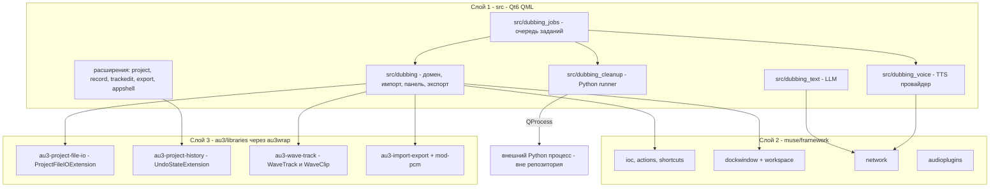

# ШАГ 2 — Архитектура RuDub Studio (по каждому пункту §6 AGENTS.md)

Дата: 2026-09-14. База: ревизия 2 `docs/analysis/audacity4_map.md` (все пути
дословно из рабочей копии тега Audacity-4.0.0). Код не пишется до согласования
roadmap (AGENTS.md §2).

---

## 0. Сводные решения

### 0.1 Размещение нового кода

По правилам Muse Framework модуль — это домен фичи: свой каталог в `src/`,
`declare_module(<name>)` в CMake, экспорт IOC-интерфейсов, свой QML-ресурс,
точка регистрации в [`src/app/appfactory.cpp:164-191`](../../src/app/appfactory.cpp)
(`app->addModule(...)`). Один гигантский `src/dubbing` на все 13 требований
нарушал бы изоляцию (сетевые AI-сервисы + локальный Python + ядро домена в одном
IOC-контейнере) и делал бы PR неделимыми. Принято **5 новых muse-модулей +
расширения существующих**:

| Модуль | Назначение | Пункты §6 |
|---|---|---|
| `src/dubbing` | Домен дубляжа: тип проекта, модель данных, персистентность в .aup3, импорт JSON+WAV, панель реплик, экспорт, операции над тейками | 6.1, 6.2, 6.3, 6.8 |
| `src/dubbing_text` | LLM-адаптация текста (muse network + QML) | 6.9 |
| `src/dubbing_cleanup` | AI-очистка голоса: runner внешнего Python-процесса, профили, A/B | 6.10 |
| `src/dubbing_voice` | Голосовой сервис: провайдер, маппинг персонаж→голос, кэш, лимиты | 6.11 |
| `src/dubbing_jobs` | Движок пакетной обработки: очередь заданий, цепочки, перезапуск упавших | 6.12 |

Расширения существующих модулей: `src/project` (тип проекта, восстановление),
`src/record` (циклическая запись), `src/trackedit` (locked-флаг, операции
«Подогнать/Выровнять/Отправить в мастер»), `src/importexport/export`
(экспорт мастер-дорожки), `src/appshell` (ProjectPage.qml — панели),
`src/preferences` (страницы настроек), `src/au3audio` (мониторинг).

Замечание о соответствии «1 модуль = 1 PR» (AGENTS.md §2.3): модуль roadmap'а =
пакет работ = 1 ветка/PR. Несколько PR последовательно расширяют один muse-модуль
(например, `src/dubbing` растёт: M1 → M2 → M3 → M8). Это отражено в
`docs/plans/roadmap.md`.

### 0.2 Точка регистрации панелей

Дословно по [`src/appshell/qml/Audacity/AppShell/ProjectPage/ProjectPage.qml:285`](../../src/appshell/qml/Audacity/AppShell/ProjectPage/ProjectPage.qml):
новая панель — элемент `DockPanel` в списке `panels: [...]` этого файла. Имя
панели для workspace-сохранности — через метод `ProjectPageModel`
([`src/appshell/qml/Audacity/AppShell/projectpagemodel.h:44-46`](../../src/appshell/qml/Audacity/AppShell/projectpagemodel.h),
по образцу `historyPanelName()`); программное открытие — действие
`dock-set-open` (см. вызов в `projectpagemodel.cpp:59-61`). Панели дубляжа:
`linesPanelName()` («Реплики»), `jobsPanelName()` («Задания»), `textPanelName()`
(«Адаптация текста»), `voicePanelName()` («Голоса»).

### 0.3 Общая схема



---

## 1. Пункт 6.1 — Тип проекта «Дубляж»

**Механизм.** Признак типа хранится в метаданных проекта; все данные дубляжа
дописываются в тот же файл проекта через штатную точку расширения
[`au3/libraries/au3-project-file-io/ProjectFileIOExtension.h`](../../au3/libraries/au3-project-file-io/ProjectFileIOExtension.h)
(интерфейс: `OnOpen/OnLoad/OnSave/OnClose/OnUpdateSaved/IsBlockLocked`;
статическая регистрация `ProjectFileIOExtensionRegistry::Extension`).

**Новые классы (в `src/dubbing/`):**
- `dubbingprojectfileioextension.h/.cpp` — реализация `ProjectFileIOExtension`:
  `OnUpdateSaved` пишет blob метаданных через `ProjectSerializer::WriteBlob`
  (дословно API: [`au3/libraries/au3-project-file-io/ProjectSerializer.h:61`](../../au3/libraries/au3-project-file-io/ProjectSerializer.h)
  `void WriteBlob(const wxString& name, const void* data, size_t size)`),
  `OnLoad` читает и восстанавливает домен; `OnSave/OnClose` — `Continue`.
- `dubbingmeta.h/.cpp` + `internal/dubbingserializer.h/.cpp` — бинарная
  сериализация домена (идентификатор версии схемы для миграций).
- `idubbingproject.h` — IOC-интерфейс доступа к домену текущего проекта
  (геттеры дерева, сигналы изменений).
- `dubbinguiactions.h/.cpp` — `UiActionList` модуля (действия панели, импорта,
  экспорта — русские названия).

**Расширения:**
- [`src/project/types/projecttypes.h:41-50`](../../src/project/types/projecttypes.h)
  `ProjectCreateOptions` — поле `bool dubbing` (+ опции: частота
  дискретизации, моно). UI выбора: [`src/project/qml/Audacity/Project/NewProjectDialog.qml`](../../src/project/qml/Audacity/Project/NewProjectDialog.qml)
  + [`src/project/view/newprojectmodel.cpp`](../../src/project/view/newprojectmodel.cpp)
  (`createProject`/`parseOptions`).
- Метаданные проекта (projectmeta) — флаг типа «Дубляж», читаемый при открытии
  на другом ПК без дополнительных папок.
- [`src/app/appfactory.cpp`](../../src/app/appfactory.cpp) — `app->addModule(new au::dubbing::DubbingModule())`.

**Отмена (метаданные).** `DubbingStateExtension : UndoStateExtension` +
`UndoRedoExtensionRegistry::Entry<DubbingStateExtension>` (дословно механизм:
[`au3/libraries/au3-project-history/UndoManager.h:84-131`](../../au3/libraries/au3-project-history/UndoManager.h));
изменения текстов/статусов идут через `IProjectHistory::pushHistoryState(...)`
или `modifyState(typeid(DubbingStateExtension))` (дословно:
[`src/trackedit/iprojecthistory.h:44-51`](../../src/trackedit/iprojecthistory.h)).
Параллельный механизм отмены не создаётся.

**Переносимость.** Аудио уже в SQLite-контейнере (sample blocks,
[`au3/libraries/au3-project-file-io/SqliteSampleBlock.cpp`](../../au3/libraries/au3-project-file-io/SqliteSampleBlock.cpp));
метаданные — в blob того же файла. Один файл = весь проект.

**Масштаб (реальный, от пользователя): 39 481 реплика / 2 181 сцена /
42 файла игры.** Рекомендация: один дубляж-проект = один файл игры
(обоснование и расчёт — §14, вопрос №2 в §15); домен внутри проекта
не меняется (файл → сцена → реплика).

**Замечание о расширении файла:** AU4 для новых проектов использует
расширение `.aup4` (дословно [`src/project/types/projecttypes.h:297-299`](../../src/project/types/projecttypes.h):
`AUP3 = "aup3"`, `AUP4 = "aup4"`, `AUP4UNSAVED = "aup4unsaved"`). Контейнер
один и тот же (SQLite). Вопрос пользователю: сохранять дубляж-проекты как
`.aup4` (штатно для AU4) или принудительно `.aup3` — см. раздел 14.

---

## 2. Пункт 6.2 — Модель данных и импорт

**Домен** (`src/dubbing/dom/`): `GameFile {fileId, scenes[]}`,
`Scene {questId, lines[]}`, `Line {guid, en, ru, speakerName, speakerInternal,
dur, orderIndex, status, refClipKey, takeClipKeys[], masterClipKey,
textHistory[]}`. `ClipKey` — дословно из
[`src/trackedit/trackedittypes.h`](../../src/trackedit/trackedittypes.h)
(`{trackId, itemId}`), доступ к клипу — `DomAccessor`
([`src/au3wrap/internal/domaccessor.h`](../../src/au3wrap/internal/domaccessor.h)).
Порядок ключей JSON = порядок реплик — `orderIndex` фиксирует порядок.

**Импорт JSON** (`src/dubbing/import/`): `dubbingjsonreader.h/.cpp` на
`QJsonDocument` (UTF-8; структура `{file_id: {quest_id: {guid: {en, ru,
speaker_name, speaker_internal, dur}}}}` — **легаси-формат M1**
(агрегат «вся игра в одном файле», зафиксирован
[`docs/requirements/sample.json`](../../docs/requirements/sample.json);
цели на момент M1: «один большой файл или по одному на file_id»).
**Целевой формат — §16.2** (реальные quest-файлы студии, два уровня).
Решение владельца (2026-09-14): миграция парсера в M2.5 с автодетектом
2/3 уровней вложенности — легаси-агрегат остаётся читаемым). Пустой
`speaker_name` → `«UNKNOWN»`.

**РЕАЛЬНЫЙ формат исходников студии (зафиксировано 2026-09-14, раздел 16).**
`docs/requirements/sample.json` — агрегат «вся игра в одном файле»,
принятый на этапе M1. Реальные исходники студии — множество
quest-файлов (`q101_st_tyna.json`, `sq001_grave.json`,
`cs_q000_1_opening.json`, `q000_01_calling_lunka_gpl.json`,
`_uncovered_npc_defaults.json`, …), внутри каждого — ДВА уровня
вложенности: `{ "<scene_id>": { "<guid_32hex>": { en, ru, speaker_name,
speaker_internal, dur? } } }`. Критичные свойства и миграция парсера —
раздел 16 (M2.5): `scene_id` — сцена, не спикер; `dur` опционален;
тексты-дубли под разными guid независимы; текущий M1-парсер ждёт
агрегат и реальный файл прочтёт неверно.

**Массовый импорт WAV** (`src/dubbing/import/`):
- `dubbingimportservice.h/.cpp` — сервис: рекурсивное сканирование папки
  (паттерн по умолчанию `{guid}.wav`, регистр нечувствителен, паттерн — в
  настройках), сопоставление по guid, статус «нет референса» не блокирует
  остальные; сверка фактической длительности (заголовок WAV/libsndfile,
  `Au3Importer::fileInfo`) с `dur` — расхождение > порога = предупреждение
  (порог в настройках, по умолчанию 100 мс).
- Строительный блок аудио — дословно
  [`src/importexport/import/internal/au3/au3importer.h:35`](../../src/importexport/import/internal/au3/au3importer.h):
  `bool importIntoTrack(const muse::io::path_t& filePath, trackedit::TrackId dstTrackId, muse::secs_t startTime)`.
- Фоновость: `muse::async::Async` + `muse::Progress`; лог импорта —
  `muse::log` + таблица результатов в UI.
- Инкрементальность: повторный импорт сопоставляет по `guid`; существующие
  `refClipKey`/`takeClipKeys`/тексты/статусы не трогаются; новые реплики
  добавляются, исчезнувшие помечаются (не удаляются).

**Раскладка дорожек.** Одна референсная дорожка на файл игры
(`REF <file_id>`), клипы по сценам в позициях кумулятивной длительности
(временная ось = порядок реплик). Раскладка — настройка (по файлу/по сцене).

**Отмена.** Добавление дорожек/клипов — через существующие вызовы
`ITrackeditInteraction` (внутри `Au3Importer` уже используется
`pushHistoryState`); слияние метаданных — `pushHistoryState(«Импорт дубляжа»)`
с `DubbingStateExtension`. Импорт идёт пакетом: один push на пакет
(`UndoPushType::CONSOLIDATE` — дословно типы в
[`src/trackedit/trackedittypes.h`](../../src/trackedit/trackedittypes.h)).

---

## 3. Пункт 6.3 — Панель списка реплик

**UI**: `DockPanel` в [`ProjectPage.qml`](../../src/appshell/qml/Audacity/AppShell/ProjectPage/ProjectPage.qml)
(`panels: [...]`), имя — `ProjectPageModel::linesPanelName()`. Файлы:
`src/dubbing/qml/Audacity/Dubbing/LinesPanel.qml` + внутренние компоненты.

**Виртуализация на десятках тысяч строк**: QML `TableView`/`TreeView` muse
(`Muse.UiComponents`) с моделью-прокси; данные — из `IDubbingProject`
(C++-модель `lineslistmodel.h/.cpp` на `QAbstractItemModel`,
сортировка/фильтрация на прокси-моделях, текстовый поиск — ленивый
(по видимой странице + отложенный полный).

**Колонки**: статус, спикер, EN, RU, длительность референса, расхождение.
**Фильтры**: UNKNOWN, статус, расхождение, отсутствующий референс.
**Двойной клик** — выбор референс-клипа (`ClipKey`) + установка позиции
воспроизведения/скролл таймлайна (`src/playback` + `src/projectscene`
API навигации) и открытие текста в рабочей зоне (панель «Реплика» с
EN/RU редактированием).

**Отмена.** Правка RU-текста из панели — `pushHistoryState(«Правка текста»)`
через `DubbingStateExtension`.

---

## 4. Пункт 6.4 — Запись и треки

**ASIO/моно.** Переиспользуется как есть: PortAudio 19.7.0 + ASIO SDK 2.3.4
из [`muse_deps/recipes/`](../../muse_deps/recipes) (`PA_USE_ASIO=ON`),
приоритет API и `AudioIO/ASIO/UseDeviceSampleRate` —
[`src/au3audio/internal/au3audiodrivercontroller.cpp`](../../src/au3audio/internal/au3audiodrivercontroller.cpp),
UI — [`src/preferences/qml/Audacity/Preferences/internal/AsioSection.qml`](../../src/preferences/qml/Audacity/Preferences/internal/AsioSection.qml).
Преднастройка «1 моно-канал» — в настройках модуля dubbing, применяется при
создании дубляж-проекта (проект моно по умолчанию).

**Циклическая запись «каждый повтор — отдельная дорожка-тейк»**
(решение §4.3 AGENTS.md, штатный punch/loop не подходит):
- `src/dubbing/record/dubbingrecordcontroller.h/.cpp` — сценарий: при
  активном «режиме дубляжа» запись каждого прохода в диапазоне
  [refStart, refEnd] текущей реплики идёт в **новую** дорожку
  `TAKE <n> <guid-короткий>`,
  создаваемую через `ITrackeditInteraction::newMonoTrack()` (дословно
  [`src/trackedit/itrackeditinteraction.h:91`](../../src/trackedit/itrackeditinteraction.h))
  + `changeTrackTitle`; остановка по `recordingFinished()`
  ([`src/record/internal/au3/au3record.cpp:660-663`](../../src/record/internal/au3/au3record.cpp)).
  Старые тейки не удаляются автоматически.
- Расширение `src/record` (`irecordcontroller`/`recorduiactions`): действие
  «Записать дубль реплики» (arm → countdown → старт/стоп по границам
  референса, светофор-индикатор).

**Locked референсная дорожка** (в Au4 флага нет — свой):
- `src/trackedit/dom/track.h` — поле `locked` (только mute/solo доступны);
- фильтр в точке входа операций `src/trackedit/internal/trackeditinteraction.cpp`
  (гвард: операция над locked-дорожкой отклоняется, кроме mute/solo);
- UI: замок в хедере дорожки
  ([`src/projectscene`](../../src/projectscene) — TrackHeader);
- персистентность locked — через домен дубляжа (blob), не меняя формат .aup3.

**Мастер-дорожка**: именованная моно-дорожка `MASTER` — конвенция домена
(создаётся при инициализации проекта дубляжа, отслеживается по `TrackId`
в метаданных). Спец-обработка: команды «Отправить в мастер» (6.6), экспорт
(6.8).

**Мониторинг входа**: по умолчанию выключен; программное включение —
настройки AudioIO/software playthrough (`src/au3audio`), переключатель в
панели записи дубляжа.

**Частота дискретизации проекта**: `ProjectCreateOptions` (6.1) +
`DEFAULT_PROJECT_SAMPLE_RATE` (переиспользуется
`AudioIOBase::GetOptimalSupportedSampleRate()`), значение фиксируется
в метаданных дубляж-проекта.

**Отмена.** Запись — штатный механизм undo записи Au4 (создание дорожки +
клипа уже обёрнуто в `pushHistoryState` внутри record/trackedit). Создание
take-дорожек — тем же путём (newMonoTrack + pushHistoryState в контроллере
дубляжа).

---

## 5. Пункт 6.5 — Автооценка тейков

**Метрики с записанного клипа** (`src/dubbing/assessment/`):
- громкость (RMS/peak) — `au3-wave-track-fft`
  ([`au3/libraries/au3-wave-track-fft/`](../../au3/libraries/au3-wave-track-fft))
  + meter-инфраструктура `src/au3wrap/internal/au3audiometer.*`;
- клиппинг — по образцу `FindClippingBase`
  ([`au3/libraries/au3-builtin-effects/FindClippingBase.h`](../../au3/libraries/au3-builtin-effects/FindClippingBase.h));
- совпадение длительности — `clipEndTime-clipStartTime`
  ([`src/trackedit/itrackeditinteraction.h:25-26`](../../src/trackedit/itrackeditinteraction.h))
  против `dur` реплики.

`takequalityservice.h/.cpp` считает метрики асинхронно (после
`recordingFinished`, без блокировки записи), результат — «подсказка, не
вердикт»: цветной индикатор в панели реплик и в хедере take-дорожки.

**Ручная маркировка**: статус тейка (лучший/отклонён) — поле домена
(`DubbingStateExtension`, undo через `pushHistoryState`).
**Компоновка лучшего тейка в мастер** — команда «Отправить в мастер» (6.6).

---

## 6. Пункт 6.6 — Редактирование

**Штатное покрытие** (проверено, переиспользуется без изменений): обрезка
(`trimClipsLeft/Right`), разделение (`splitTracksAt` и др.), перемещение
(`moveClips`), фейды (Fade In/Out — `src/effects/builtin_collection/fade/`),
кроссфейд (стыковка клипов + envelope), громкость (amplify), нормализация
(normalize/loudness), тишина (`silenceTracksData`), реверс
(`src/effects/builtin_collection/reverse/`), тайм-стрейч без тона —
SBSMS/SoundTouch (`AU_USE_SBSMS`/`AU_USE_SOUNDTOUCH`,
[`CMakeLists.txt:100-101`](../../CMakeLists.txt)), `changeClipSpeed`/
`stretchClipsLeft/Right` (дословно
[`src/trackedit/itrackeditinteraction.h:42,82-85`](../../src/trackedit/itrackeditinteraction.h)).

**Новые операции** — методы `ITrackeditInteraction`
([`src/trackedit/itrackeditinteraction.h`](../../src/trackedit/itrackeditinteraction.h)),
реализация в `src/trackedit/internal/trackeditinteraction.cpp` +
`src/au3wrap/internal/domaccessor.h` доступ к клипам; действия/хоткеи —
`src/trackedit/internal/trackedituiactions.*` (русские названия):

1. `fitClipToReference(ClipKey, guid)` — «Подогнать под референс»: целевая
   длительность = `dur` реплики; стретч без тона через `WaveClip` stretch
   ratio (тот же механизм, что `changeClipSpeed`, пересчёт коэффициента из
   отношения длительностей);
2. `alignClipToReference(ClipKey, guid)` — «Выровнять по референсу»:
   `changeClipStartTime(clipKey, refStart, completed=true)` + при необходимости
   `makeRoomForClip` (дословно
   [`src/trackedit/itrackeditinteraction.h:89`](../../src/trackedit/itrackeditinteraction.h));
3. `sendClipToMaster(ClipKey, crossfadeSec)` — «Отправить в мастер»: перенос
   копии клипа на мастер-дорожку (`moveClips` c `trackPositionOffset` или
   copy+paste внутренними средствами) + автокроссфейд по краям (вписывание
   envelope).

**Отмена.** Все три — `pushHistoryState(«Подогнать под референс»/…)` внутри
реализации; drag-варианты — `startUserInteraction/endUserInteraction`
(дословно [`src/trackedit/iprojecthistory.h:56-74`](../../src/trackedit/iprojecthistory.h)).

---

## 7. Пункт 6.7 — Надёжность

**Undo/redo на сессию + сохранение в .aup3** — переиспользуется целиком:
`IProjectHistory` поверх au3 `ProjectHistory`/UndoStack (карта, §2 анализа).
Метаданные дубляжа включены в те же состояния через
`DubbingStateExtension` (см. раздел 1).

**Автосейв** — проверить и оставить: включён по умолчанию, 5 минут, только
при изменениях ([`src/project/internal/projectconfiguration.cpp`](../../src/project/internal/projectconfiguration.cpp),
[`src/project/internal/projectautosaver.cpp`](../../src/project/internal/projectautosaver.cpp));
данные дубляжа попадают в автосейв автоматически (тот же
`OnUpdateSaved`-путь `ProjectFileIOExtension`).

**Восстановление после сбоя**: `IAu3Project::isRecovered()`
([`src/au3wrap/iau3project.h`](../../src/au3wrap/iau3project.h)) уже даёт
факт восстановления. Расширение `src/project`
(`opensaveprojectscenario.cpp`/стартовый экран): предложение
«Обнаружена несохранённая сессия (снимок <дата-время>) — восстановить?»;
время снимка брать из метки файла автосейва/`hasAutosaveData`. Правка
маленькая, отдельный PR (M7).

---

## 8. Пункт 6.8 — Экспорт результата

**Базовый блок** — `IExporter::exportData` (дословно
[`src/importexport/export/iexporter.h:43-44`](../../src/importexport/export/iexporter.h)):

```cpp
virtual muse::Ret exportData(const muse::io::path_t& path, const Options& options = {},
                             muse::ProgressPtr progress = nullptr,
                             au::project::IAudacityProjectPtr project = nullptr) = 0;
```

**Расширение** (`src/importexport/export/` + `src/dubbing/export/`):
`dubbingexportservice.h/.cpp` — экспорт выбранного клипа/диапазона
мастер-дорожки в WAV (16/24-bit PCM или FLAC — lossless) с явным заданием
имени файла. Ограничение текущего экспорта — привязка к выделению/времени;
для реплики: временно установить выделение [refStart, refEnd] по
`ClipKey` мастер-клипа реплики → `exportData` в `{guid}.wav` → вернуть
выделение.

**Пакетный экспорт по фильтру**: область = файл/сцена/спикер/статус
(фильтры домена 6.3); имя из шаблона с подстановками
(`{guid}`, `{file_id}`, `{quest_id}`, `{speaker}`) — шаблон в настройках;
прогресс/лог как у импорта (M2-инфраструктура переиспользуется).

**WEM** — только раздел «отложено» roadmap'а (раздел 3 AGENTS.md).

**Отмена.** Экспорт не меняет проект; отметка «экспортировано» (статус
реплики) — через `DubbingStateExtension` + `pushHistoryState`.

---

## 9. Пункт 6.9 — Адаптация текста (LLM)

**Модуль `src/dubbing_text` целиком с нуля** (muse network —
`muse/framework/network`, `NetworkModule` уже в
[`src/app/appfactory.cpp:156`](../../src/app/appfactory.cpp); QNetwork
обёртки без libcurl: `AU_USE_LIBCURL=OFF`
[`CMakeLists.txt:104`](../../CMakeLists.txt)).

- `illmprovider.h` — интерфейс провайдера: `generate(request) -> variants`;
  запрос = EN + текущий RU + метаданные (длительность, спикер).
- `internal/openaiprovider.*` — OpenAI-совместимый облачный API (приоритет,
  §4.5 AGENTS.md); `internal/ollamaprovider.*` — Ollama-совместимый локальный.
  Выбор провайдера/эндпоинта/ключа/модели — в настройках (без пересборки),
  страница настроек в `src/dubbing_text/qml/.../Preferences`.
- Панель «Адаптация текста»: EN (ro), текущий RU, 3 варианта с объяснением
  LLM; для каждого — слоги (локальный счётчик слогов RU), оценка попадания
  в длительность (слоги/сек против референса), совпадение первого/последнего
  звука с EN (сравнение фонетических классов начала/конца — локальная
  эвристика, словарь окончаний).
- История версий RU-текста с откатом: версии хранятся в домене
  (`Line::textHistory`), выбор версии = правка текста → undo через
  `pushHistoryState` (стандартный путь, откат = обычный undo или выбор
  старой версии из списка).
- Все запросы online, offline-фолбэки не проектируются (раздел 3).

---

## 10. Пункт 6.10 — Очистка голоса (AI)

**Модуль `src/dubbing_cleanup`**: внешний локальный Python-процесс
(RNNoise/DeepFilterNet — устанавливается вручную вне репозитория), вызов из
приложения через `QProcess` (`QT_QPROCESS_SUPPORTED` —
[`CMakeLists.txt:167`](../../CMakeLists.txt)), не блокирует запись.

- `icleanupengine.h` + `internal/pythonprocess.*` — запуск
  `python -m <engine>` с профилем; обмен — WAV во временной папке +
  JSON-статус; два профиля: «слабый» (CPU/RTX 4060) и «мощный» (RTX 4080S)
  (§4.6 AGENTS.md) — путь к интерпретатору и параметры профилей в настройках.
- Цепочка (каждый шаг включаемый): шумоподавление (Python), гул (штатный
  high-pass/Notch — builtin), свистящие/взрывные (Python/де-эссер);
  штатные Noise Reduction / Click Removal вызываются программно как часть
  цепочки через `IEffectExecutionScenario::performEffect(effectId, params)`
  (дословно [`src/effects/effects_base/ieffectexecutionscenario.h:23-24`](../../src/effects/effects_base/ieffectexecutionscenario.h)).
- A/B «было/стало»: результат кладётся как новый клип рядом (take-модель),
  прослушивание A/B до подтверждения; подтверждение = замена аудио тейка.
- Пакетный прогон по фильтру с логом и перезапуском только ошибок —
  через движок заданий (6.12).

**Отмена.** Применение цепочки к тейку — аудио-изменение через штатный
path эффектов (`pushHistoryState` при apply); откат — undo. До
подтверждения A/B проект не меняется.

---

## 11. Пункт 6.11 — Голосовой сервис

**Модуль `src/dubbing_voice` с нуля** (muse network):

- `ivoiceprovider.h` — настраиваемый провайдер: endpoint + auth + модель
  в настройках (§4.4); режимы «голос-в-голос» (клонирование по референсу)
  и «текст-в-голос» (синтез).
- Маппинг `speaker_internal` → голос (+ вариации: шёпот и т.п. — отдельные
  настройки голоса) — таблица домена, хранится в blob (6.1), UI-панель
  «Голоса».
- Кэш: ключ = hash(текст + голос + параметры) → сгенерированный WAV в
  кэш-папке проекта/настроек; повтор не тратит лимит. Индикатор остатка
  лимита (символы/кредиты — уточняется при реализации, конфигурируемое
  поле в настройках), блокировка при нуле; предрасчёт расхода перед batch
  (движок заданий запрашивает у провайдера оценку по фильтру).
- Все запросы online, фолбэков нет (раздел 3).

**Отмена.** Генерация создаёт новый клип (импорт WAV) — undo через штатный
импорт-путь; маппинг персонаж→голос — `DubbingStateExtension`.

---

## 12. Пункт 6.12 — Пакетная обработка

**Модуль `src/dubbing_jobs` с нуля** (Macros в AU4 нет — доказано
`docs/analysis/audacity4_map.md` §7):

- Модель: `Job {id, scope (проект/файл/сцена/спикер/выделенные),
  chain[] (очистка → голосовой сервис → подгонка → экспорт), state,
  log, attempts}`.
- `jobsengine.h/.cpp` — последовательный прогон по списку реплик из
  фильтра; каждый шаг вызывает сервисы 6.10/6.11/6.6/6.8 по IOC;
  остановка/пауза; ошибки не валят очередь.
- Переживание перезапуска: очередь сериализуется в blob проекта (через
  `ProjectFileIOExtension` из 6.1), при старте модуль восстанавливает
  очередь и предлагает продолжить; перезапускаются только упавшие.
- UI: панель «Задания» (`jobsPanelName()`), прогресс/лог, фильтр области,
  предрасчёт расхода голосового сервиса (6.11) перед запуском.

**Отмена.** Шаги заданий меняют проект только через уже описанные
undo-механизмы соответствующих модулей; состояние очереди — метаданные
(`DubbingStateExtension`, `modifyState(typeid(...))` — автосейв подхватит).

---

## 13. Пункт 6.13 — Интерфейс

- **Полностью русский**: весь новый пользовательский текст — на русском
  (AGENTS.md §5), включая `UiActionList`-названия действий; переводческий
  механизм muse (`framework/languages`) для новых строк — qm-файлы
  (`AU_RUN_LRELEASE`, [`CMakeLists.txt:149`](../../CMakeLists.txt)).
- **Тёмная тема по умолчанию**: muse `framework/draw`, выбор темы — в
  FirstLaunchSetup/Preferences (уже в комплекте); фиксация дефолта —
  настройка модуля appshell/preferences.
- **Хоткеи**: `framework/shortcuts` — переназначение + экспорт/импорт
  раскладки штатно; новые действия объявляются в `UiActionList` модулей
  (пример-образец: [`src/trackedit/internal/trackedituiactions.h`](../../src/trackedit/internal/trackedituiactions.h)).
- **Панели**: `Muse.Dock` (`DockPanel` в ProjectPage.qml, §0.2),
  перетаскивание/раскладка запоминаются через `framework/workspace`
  (WorkspaceModule — [`CMakeLists.txt:137`](../../CMakeLists.txt)).

---

## 14. Оценка размера .aup3 при хранении референсов внутри (реальный масштаб)

Реальный масштаб проекта (дано пользователем): **39 481 реплика,
2 181 сцена, 42 файла игры** (в среднем ≈ 940 реплик на файл игры,
≈ 18 реплик на сцену).

**Формула (допущения показаны явно):**

```
V = N × ( T̄ref × Bref  +  Ktake × Ttake × Btake  +  T̄master × Bmaster )

N       = 39 481 реплик
T̄ref    = 2.1 с   — средняя длительность реплики по docs/requirements/sample.json
                   (фактическая средняя по группам ≈ 2.06–2.12 с, округлено вверх)
Bref    = 0.144 МБ/с — референс 24-bit PCM: 48 000 сэмплов/с × 3 байта, моно
Ktake   = 2        — тейков на реплику в среднем (старые не удаляются, §4.3)
Ttake   = 2.3 с    — тейк = T̄ref + 0.2 с запас на края
Btake   = 0.192 МБ/с — запись 32-bit float: 48 000 × 4 байта, моно
T̄master = 2.1 с   — мастер-клип ≈ длительность реплики
Bmaster = 0.144 МБ/с — мастер 24-bit PCM
```

Сэмплы в SQLite хранятся без сжатия (SqliteSampleBlock); накладные расходы
БД ≈ 2–5%. Единицы десятичные (1 ГБ = 10⁹ байт).

**На одну реплику:**
- референс: 2.1 × 0.144 = **0.302 МБ**
- тейки: 2 × 2.3 × 0.192 = **0.883 МБ**
- мастер: 2.1 × 0.144 = **0.302 МБ**
- **итого ≈ 1.49 МБ на реплику**

**Итого на весь масштаб (39 481 реплика):**

| Компонент | Расчёт | Объём |
|---|---|---|
| Референсы | 39 481 × 2.1 с × 0.144 МБ/с | ≈ 11.9 ГБ |
| Тейки | 39 481 × 2 × 2.3 с × 0.192 МБ/с | ≈ 34.9 ГБ |
| Мастер | 39 481 × 2.1 с × 0.144 МБ/с | ≈ 11.9 ГБ |
| **Монолит «вся игра в одном .aup3»** | | **≈ 58.7 ГБ** (+2–5% БД) |

**Порог 15 ГБ превышен почти в 4 раза** (58.7 ГБ). Даже без тейков
(референсы + мастер = 23.8 ГБ) порог превышен; снижение форматов не спасает:
референсы 16-bit + тейки 24-bit + мастер 16-bit ≈ 1.07 МБ/реплику →
≈ 42 ГБ — всё ещё выше порога. Дополнительные минусы монолита: единая
точка отказа на ~59 ГБ, копирование между ПК и полный checkpoint БД —
минуты, единовременный начальный импорт ~12 ГБ референсов.

**Пересмотренная стратегия (рекомендация):**
1. **Один дубляж-проект = один файл игры** (42 проекта). Средний размер:
   ≈ 940 реплик × 1.49 МБ ≈ **1.4 ГБ**; гипотетический файл игры в
   5 000 реплик ≈ 7.4 ГБ — под порогом (фактический максимум по файлам
   уточнить при первом импорте). Требование «один файл — другой ПК»
   сохраняется на уровне файла игры; домен и все механизмы (6.1–6.12) не
   меняются — меняется только число проектов. Пакетные операции (6.12)
   работают внутри проекта; межфайловые сценарии не проектируются.
2. **Порог внешних ссылок остаётся 15 ГБ на ОДИН .aup3** (жёсткий лимит).
   При выбранной стратегии он не достигается; режим «внешние ссылки»
   (референс-дорожки ссылаются на папку, в .aup3 — только метаданные и
   тейки) — резервная опция на аномальный случай (один файл игры
   > ~35 000 реплик), осознанно нарушающая переносимость одним файлом.
3. Кэш голосового сервиса (6.11) и временные файлы очистки (6.10) хранятся
   **вне** .aup3 (папка кэша из настроек) — уже заложено в архитектуру.
4. Тейки пишутся 32-bit float (качество, штатно); опциональная настройка
   «тейки в 24-bit» снижает объём тейков до ≈ 26.2 ГБ на всю игру /
   ≈ 0.62 ГБ на средний файл (2 × 2.3 × 0.144 = 0.662 МБ/реплику).

---

## 15. Явные вопросы (полные формулировки с рекомендациями — docs/plans/roadmap.md §4)

1. **Расширение файла проекта**: `.aup4` (штатно для новых проектов AU4;
   рекомендация) или принудительно `.aup3`? Контейнер идентичен (SQLite).
2. **Стратегия хранения при реальном масштабе**: подтверждается ли «один
   дубляж-проект = один файл игры» (раздел 14) вместо монолита 58.7 ГБ?
   Порог внешних ссылок 15 ГБ на один .aup3 остаётся жёстким лимитом.
3. **Порядок AI-модулей**: M9 (LLM) → M10 (очистка) → M11 (голос) —
   оставить или поднять голосовой сервис раньше LLM?
4. **Лимит голосового сервиса**: символы или кредиты? Выбран ли конкретный
   сервис/API (влияет на провайдера в M11)?
5. **Движки AI-очистки**: DeepFilterNet (мощный) + RNNoise (слабый);
   Python-окружение разворачивается вручную (venv, путь в настройках)?

---

## 16. Sidecar-контракт дубляжа (решение заказчика 2026-09-14, вариант B — оверлей статусов)

Категория 2 по AGENTS.md §9: решение заказчика, обязательно к исполнению.
Реализация — модуль M2.5 (до M4); этот раздел — контракт.

### 16.1 Принцип

Исходные quest-файлы студии остаются byte-identical оригиналу:
программно НИКОГДА не дописывать в них status/правки (ломает приём
обновлений от геймдиза и чистую сдачу материала назад). Вместо этого —
параллельный набор файлов-оверлеев, один-к-одному с исходными по имени
файла, плоский по структуре (уровень scene_id не нужен: guid глобально
уникален независимо от сцены и файла).

### 16.2 Реальный формат исходников (phrases/, read-only)

Множество файлов по квестам/сценам: `q101_st_tyna.json`,
`sq001_grave.json`, `_uncovered_npc_defaults.json`,
`cs_q000_1_opening.json` (кат-сцена), `q000_01_calling_lunka_gpl.json`
(игровые реплики), … Внутри каждого — два уровня:

```
{
  "<scene_id>": {
    "<guid_32hex_no_dashes>": {
      "en": "...", "ru": "...",
      "speaker_name": "...", "speaker_internal": "...",
      "dur": 1.385
    }
  }
}
```

Критично:
- **scene_id != speaker_internal и не идентичен ему.** Ключ верхнего
  уровня — сцена/бит диалога; одна сцена содержит реплики РАЗНЫХ
  персонажей, у каждой строки свой speaker_internal (пример:
  cs_q000_1_opening содержит Coen, Lunka, Esme, Pieter, Mirto).
  Совпадение scene_id со спикером в монологовой сцене одного NPC —
  частный случай, НЕ правило. Группировка реплик по scene_id как по
  спикеру — ошибка.
- **dur опционален.** Пример: q000_3_after_tutorial, guid
  8B121AC84E9295D4D1122D869CAF8B4A — без dur; рядом дубль того же
  текста под другим guid 23BB8EAC45A3DE20CBF7718E53114C77 — с dur
  0.978. Это два РАЗНЫХ независимых элемента (вероятно, ветвление
  диалога), не дубликат для слияния/удаления.
- **speaker_internal — таксономия с точками** (Character.Main.Coen,
  Character.Secondary.Lunka, Character.Background.000.soldier01).
  Потенциальное поле фильтров M3+ «главные/второстепенные/фон» —
  зафиксировано как задел, НЕ реализовано.
- **Наблюдение об именах файлов**: префикс "cs_" (похоже — кат-сцена),
  суффикс "_gpl" (похоже — игровые реплики), обычные имена без
  суффикса. Парсинг категории по имени файла НЕ делаем; наблюдение
  зафиксировано.

### 16.3 Оверлей phrases_status/

```
phrases/                    <- зеркало исходников студии, read-only
  q101_st_tyna.json
  cs_q000_1_opening.json
  ...
phrases_status/             <- НАШ оверлей: один файл на каждый исходный
  q101_st_tyna.json           (то же имя!), плоский по guid
  cs_q000_1_opening.json      (без вложенности scene_id)
  ...
```

Схема одной записи (плоская):

```json
{
  "<guid_32hex>": {
    "status": "not_started" | "recorded" | "approved",
    "ru_override": "текст" | null,
    "base_ru_snapshot": "текст ru из phrases/ на момент создания override",
    "updated_at": "2026-09-14T12:00:00Z"
  }
}
```

- **status** — рабочий статус реплики; источник правды ТОЛЬКО здесь,
  в исходнике такого поля нет и не будет.
- **ru_override** — правка RU из рабочей зоны M3 (под липсинк/тайминг)
  пишется сюда, не в phrases/. null = используется оригинальный ru.
- **base_ru_snapshot** — копия оригинального ru НА МОМЕНТ создания
  override; нужна для детекта устаревания: если геймдиз пришлёт новую
  версию phrases/{quest}.json и ru изменится, а snapshot не совпадёт —
  warning «перевод обновлён студией, проверь свою правку» (UI — за
  рамками M2.5, требование к M4/M5).
- **updated_at** — отладка и сортировка «недавно изменённое».

Два guid с одинаковым текстом — два НЕЗАВИСИМЫХ ключа в
phrases_status/: правка одного НЕ затрагивает другой.

### 16.4 Чтение и запись

ЧТЕНИЕ (per guid, независимо от scene_id и файла):

```
effective_ru     = phrases_status[guid].ru_override ?? phrases[guid].ru
effective_status = phrases_status[guid].status       ?? "not_started"
```

ЗАПИСЬ (правка RU в рабочей зоне M3):
1. записать ru_override + base_ru_snapshot (= текущий phrases[guid].ru)
   + updated_at в phrases_status/{тот же filename}.json;
2. pushHistoryState ОДНОЙ операцией (см. 16.5);
3. phrases/{quest}.json НЕ трогается никогда программно.

### 16.5 Атомарность и undo

Правка RU — ОДНА undo-операция, которая меняет in-memory домен Line
(мгновенный отклик UI) И физически пишет phrases_status/{quest}.json
на диск. Запись на диск — побочный эффект внутри той же команды,
которая создаёт запись истории. Откат истории откатывает и файл —
повторной записью предыдущего снапшота записи, не только in-memory
rollback. Текущий механизм: IProjectHistory::pushHistoryState (одно
действие на правку, см. раздел 3) — побочный эффект диска добавляется
внутри этого же вызова сервиса.

ОТКРЫТЫЙ ВОПРОС (не решать без заказчика): debounce перед физической
записью при быстром вводе текста. Рекомендация: писать сразу (файл
маленький, per-quest, ~сотни записей), undo перезаписывает файл целиком
из снапшота команды; debounce ввести только при замере реальных
нагрузок.

### 16.6 Связь dur (исходник) <-> actualDur (WAV, M2)

dur из phrases/ — проектный хронометраж; actualDur — фактическая
длительность референсного WAV (заполняется при импорте M2). Сравнение
|actualDur - dur| > 0.1 c — предупреждение (NeighbourMismatchDuration).
При ОТСУТСТВУЮЩЕМ dur (16.2): сравнение НЕ выполняется (предупреждения
нет), колонка «Длит.» показывает actualDur, фильтр «расхождение» не
срабатывает; при отсутствии и WAV длительность неизвестна. Текущий
M1-парсер требует dur (пропускает реплику без него с ошибкой в логе) —
миграция в M2.5.

### 16.7 Привязка Line -> имя файла квеста

Для записи в правильный phrases_status/{filename}.json домен Line
должен знать исходный файл. Сейчас Line не хранит источник (в агрегате
M1 fileId был ключом верхнего уровня JSON). M2.5: GameFile.fileId :=
имя исходного файла (без пути, без расширения), сохраняется как id
тега <file> в .aup4; один дубляж-проект = один файл игры (§14), но
домен допускает несколько.

---

## 17. Структура пакета MyDub и WORK-зона (контракт M4)

```
MyDub/
  MyDub.aup4
  phrases/{зеркало исходников студии, read-only}
  phrases_status/{оверлей: status + ru_override, тот же filename}
  refs/{guid}.wav
  takes/{guid}/takeN.wav
  outs/{guid}.wav
```

guid — плоский общий namespace для refs/takes/outs, независимо от
scene_id и от того, из какого файла квеста реплика.

Таймлайн при выборе реплики (WORK-зона, контракт M4):
- REF-хранилище (M2) — скрыто, источник refClipId.
- WORK REF — референс ТОЛЬКО выбранной реплики.
- WORK TAKES — тейки ТОЛЬКО выбранной реплики (takes/{guid}/*.wav).
- WORK OUT — outs/{guid}.wav, если есть.
- MASTER OUT — собранный итоговый дубляж, виден постоянно.
- Переключение реплики = перезаполнение WORK-зоны, НЕ мутация истории
  вставкой/удалением клипов.

