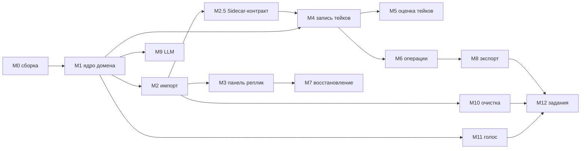

# ШАГ 3 — Roadmap RuDub Studio: модули (1 модуль = 1 PR = 1 ветка)

Дата: 2026-09-14. Основано на: `docs/analysis/audacity4_map.md` (ревизия 2),
`docs/plans/architecture.md` (ШАГ 2). Код не пишется до согласования этого
файла (AGENTS.md §2 п.6).

## 0. Правила исполнения

- Один модуль roadmap'а = одна ветка = один PR. Muse-модуль ≠ PR: несколько
  PR последовательно расширяют один muse-модуль (`src/dubbing`: M1→M2→M3→M8).
- Коммиты — conventional commits, описание на русском (AGENTS.md §5).
- Любое изменение состояния проекта — только через `IProjectHistory`
  (`pushHistoryState` / `startUserInteraction` / `endUserInteraction` /
  `modifyState(typeid(...))`); параллельный механизм отмены запрещён.
- Каждый PR содержит тест, доказывающий критерий готовности (ctest,
  `AU_BUILD_*_TESTS`). Без реального прогона модуль не считается готовым.
- Весь новый пользовательский текст — на русском.

## 1. Последовательность модулей



---

## M0. Подготовка сборочной машины (не PR — обязательный этап)

**Состав:** установка Qt 6.10 MSVC 2022 x64 (+ Network Auth, Shader Tools,
State Machines, Qt 5 Compatibility), CMake ≥ 3.24, Ninja, MSVC 2022;
конфигурация `audacity-debug` из [`CMakePresets.json`](../../CMakePresets.json);
первая сборка; прогон существующего тестового набора.

**Фактическая процедура (выполнена и зафиксирована 2026-09-14, AGENTS.md §9).**
Окружение: VS 18 BuildTools MSVC 14.50.35717 (cl 19.50), CMake 4.2.3-msvc3 и
Ninja из состава VS, Qt 6.10.1 msvc2022_64 (D:/Qt/6.10.1/msvc2022_64).
Важно: пресет `audacity-debug` (Debug) на этой машине НЕ собирается — muse_deps
использует prebuilt-пакеты только при RelWithDebInfo (дословно
`muse_deps/buildtools/resolve.cmake:460-461`: `if(NOT mode STREQUAL "rebuild" AND config STREQUAL "RelWithDebInfo")`),
а source-fallback падает на libpng (не находит ZLIB). Поэтому рабочий пресет —
`audacity-release` (RelWithDebInfo, отладочные PDB на MSVC сохраняются).

```
:: 1) Конфигурация (командная строка cmd из корня d:/auda/audacity)
call "C:\Program Files (x86)\Microsoft Visual Studio\18\BuildTools\VC\Auxiliary\Build\vcvars64.bat"
"C:\Program Files (x86)\Microsoft Visual Studio\18\BuildTools\Common7\IDE\CommonExtensions\Microsoft\CMake\CMake\bin\cmake.exe" --preset audacity-release -DCMAKE_PREFIX_PATH=D:/Qt/6.10.1/msvc2022_64

:: 2) Сборка
"C:\Program Files (x86)\Microsoft Visual Studio\18\BuildTools\Common7\IDE\CommonExtensions\Microsoft\CMake\CMake\bin\cmake.exe" --build build\audacity-release

:: 3) Тесты (PATH обязателен: Qt + все _deps\*\bin + wxwidgets-DLL)
powershell -NoProfile -Command "$root = 'd:/auda/audacity/build/audacity-release'; $bins = Get-ChildItem -Directory ($root + '/_deps') | ForEach-Object { Join-Path $_.FullName 'bin' } | Where-Object { Test-Path $_ }; $env:PATH = 'D:/Qt/6.10.1/msvc2022_64/bin;' + $root + '/_deps/wxwidgets/lib/vc_x64_dll;' + ($bins -join ';') + ';' + $env:PATH; & 'C:/Program Files (x86)/Microsoft Visual Studio/18/BuildTools/Common7/IDE/CommonExtensions/Microsoft/CMake/CMake/bin/ctest.exe' --test-dir $root --output-on-failure"
```

:: 4) Дистрибутив для ручной проверки (self-contained, с windeployqt)
"C:\Program Files (x86)\Microsoft Visual Studio\18\BuildTools\Common7\IDE\CommonExtensions\Microsoft\CMake\CMake\bin\cmake.exe" --install build\audacity-release --prefix D:/auda/audacity/dist
:: Проверка: dist\bin\Audacity4.exe --plugin-registration-self-test  (exit 0)
:: ВАЖНО (выяснено в M3): смок — только из dist. Запуск src\app\bin\Audacity4.exe
:: из дерева сборки даёт предупреждение «Critical Nyquist files could not be
:: found. Nyquist effects will not work.»: NyquistEffectsModule::Initialize
:: (au3-nyquist-effects/LoadNyquist.cpp:127-148) ищет nyquist-runtime\nyquist.lsp
:: по путям относительно exe, а этот каталог деплоится только cmake --install.
:: Это свойство окружения (не ошибка сборки): nyquist-эффекты отключаются,
:: остальные модули и сам смок работают, exit 0.

**Результат M0:** сборка успешна (3319 целей, `src/app/bin/Audacity4.exe`,
PortAudio+ASIO из исходников по REBUILD-флагу). ctest после фикса тестов
(см. ниже) — **29/29 (100%)**.

**Исправленный дефект тестов апстрима (коммит ff6fa31a3):** кейс
`Load_FileCannotBeOpened_ReturnsCantOpen` на Windows падал и оставлял
открытым соединение с БД. Цепочка: testtools «read protection» =
`FILE_ATTRIBUTE_HIDDEN` (не запрещает чтение) → SQLite открывает файл →
`load()` успешен → тест не вызывает close (апстрим-комментарий «can't close»)
→ при разрушении проекта срабатывает `wxASSERT_MSG(!mpConnection, "Project
file was not closed at shutdown")` в `ConnectionPtr::~ConnectionPtr`
(`au3/libraries/au3-project-file-io/DBConnection.cpp:701-707`) — это и есть
wxWidgets Debug Alert; незакрытое SQLite-соединение держит файловые хендлы —
отсюда неудаляемый `empty_read_protected.aup4` (+`-wal`/`-shm`).
Фикс: (1) кейс помечен `GTEST_SKIP` на Windows с пояснением (POSIX-семантика
прав); (2) `testtools::removeIfExists` на Windows сбрасывает read-only/hidden
атрибуты перед удалением — устранён мусор от write-protected кейсов.
После фикса: полный вывод au_project_tests без `removeIfExists: failed`,
в `data/` только штатные фикстуры, диалог assert'а не возникает (нет
проектов, разрушаемых с открытым соединением).

**Критерий готовности:** приложение собирается и запускается на целевой
машине; ctest зелёный (или зафиксирован список заранее красных тестов
апстрима); процедура записана в этот файл. **Статус: ВЫПОЛНЕНО.**

---

## M1. Ядро домена дубляжа и тип проекта (§6.1)

**Muse-модуль:** `src/dubbing` (создаётся; `declare_module(dubbing)`;
регистрация в [`src/app/appfactory.cpp`](../../src/app/appfactory.cpp)).

**Затрагиваемые файлы/классы (фактически по итогам реализации):**
- Новые: `src/dubbing/dubbingmodule.*` (IModuleSetup — линковка регистраций),
  `src/dubbing/dubbingtypes.h` (домен: GameFile/Scene/Line/TakeInfo/статусы),
  `src/dubbing/internal/dubbingproject.*` (attached-объект домена на
  AudacityProject + XMLTagHandler + статические регистрации в
  `ProjectFileIORegistry`), `src/dubbing/internal/dubbingstateextension.*`
  (`: UndoStateExtension` + `UndoRedoExtensionRegistry::Entry` —
  [`au3/libraries/au3-project-history/UndoManager.h:84-131`](../../au3/libraries/au3-project-history/UndoManager.h)),
  `src/dubbing/tests/{environment.cpp,dubbingdomain_tests.cpp}`.
- **Уточнение механизма персистентности (по дословному разбору кода):**
  вместо `ProjectFileIOExtension`+`WriteBlob` используется штатный реестр
  документа проекта: `ProjectFileIORegistry = XMLMethodRegistry<AudacityProject>`
  ([`au3/libraries/au3-project/Project.h:133-135`](../../au3/libraries/au3-project/Project.h));
  `ObjectWriterEntry` пишет тег `<dubbing>` в корень `<project>` при каждом
  Save/AutoSave (вызов из
  [`au3/libraries/au3-project-file-io/ProjectFileIO.cpp:1862`](../../au3/libraries/au3-project-file-io/ProjectFileIO.cpp)),
  `ObjectReaderEntry("dubbing", …)` читает его при LoadProject. OnUpdateSaved
  у ProjectFileIOExtension вызывается ПОСЛЕ записи doc и для дописывания
  данных непригоден; ProjectFileIOExtension в M1 не используется.
- Расширения: [`src/project/types/projecttypes.h`](../../src/project/types/projecttypes.h)
  (`ProjectCreateOptions.dubbing`), регистрация модуля в
  [`src/app/appfactory.cpp`](../../src/app/appfactory.cpp) и
  `src/app/CMakeLists.txt`, `src/CMakeLists.txt`, опция
  `AU_BUILD_DUBBING_TESTS` в корневом [`CMakeLists.txt`](../../CMakeLists.txt).
  IOC-интерфейс `idubbingproject.h`, настройки `dubbingconfiguration.*`,
  диалог выбора типа «Обычный/Дубляж» в NewProjectDialog.qml и страница
  настроек Dubbing переносятся в M2 (появится первый потребитель —
  импорт/панель).

**Механизм отмены:** `DubbingStateExtension` в UndoStack au3; правки
метаданных — `pushHistoryState` / `modifyState(typeid(DubbingStateExtension))`
(дословно [`src/trackedit/iprojecthistory.h:44-51`](../../src/trackedit/iprojecthistory.h)).

**Сложность/риски:** средняя. Риски: эволюция XML-схемы тега `<dubbing>`
(митигируется атрибутом `version` + миграциями при чтении); объём XML при
десятках тысяч реплик (строки в атрибутах; при необходимости M2 переводит
тексты в blob-атрибут — `HandleXMLBlob` уже поддержан фреймворком).
Риск автосейва снят тестом: AutoSave идёт тем же WriteXML-путём, тег
попадает в снимок автоматически.

**Критерий готовности (тест):** создать дубляж-проект → изменить RU-текст
реплики → undo/redo восстанавливает текст → сохранить → переоткрыть файл на
другой машине/пути → домен (дерево, тексты, статусы) идентичен; автосейв
создаёт снимок с данными дубляжа.
**Статус: ВЫПОЛНЕНО (2026-09-14, ветка feature/dubbing-m1-core).** Реальный
прогон `dubbing_tests` — 3/3 OK: UndoRedo_RuText (штатный ProjectHistory +
DubbingStateExtension), SaveAndReopen_DomainRoundTrip (save → load через
Au3ProjectAccessor, домен идентичен, признак isDubbing сохранён),
RegularProject_NotDubbing. Автосейв с данными дубляжа обеспечен тем же
путём WriteXML (AutoSave вызывает WriteXML → CallWriters → наш тег).
Диалог создания проекта с выбором типа — в M2 (вместе с IOC-сервисом).

**Переиспользуется/расширяется/с нуля:** переиспользуются ProjectFileIO
(Save/Load/AutoSave как есть), `ProjectFileIORegistry`-механика
(ObjectWriterEntry/ObjectReaderEntry), UndoStack-расширения
(UndoStateExtension); расширяются project (признак типа) и проводка
приложения; с нуля — домен, XML-сериализация, тест; IOC-сервис и настройки —
M2.

## M2. Импорт JSON + массовый импорт WAV по guid (§6.2)

**Muse-модуль:** расширение `src/dubbing` (каталог `import/`).

**Затрагиваемые файлы/классы:**
- Новые: `import/dubbingjsonreader.*` (QJsonDocument, UTF-8; порядок ключей =
  порядок реплик), `import/dubbingimportservice.*` (сканирование папки
  рекурсивно, паттерн `{guid}.wav` из настроек, регистр нечувствителен;
  статусы; сверка `dur` с фактической длительностью через
  `Au3Importer::fileInfo`), `import/dubbingimportlog.*`, диалог импорта
  `qml/.../DubbingImportDialog.qml`, `tests/dubbingimport_tests.cpp`
  (фикстура: `docs/requirements/sample.json` + синтетические WAV).
- Переиспользование (без изменений): `Au3Importer::importIntoTrack` (дословно
  [`src/importexport/import/internal/au3/au3importer.h:35`](../../src/importexport/import/internal/au3/au3importer.h)),
  mod-pcm/libsndfile, `muse::Progress`.

**Механизм отмены:** ЕДИНЫЙ `pushHistoryState(«Импорт дубляжа»)` на весь
импорт — объединённый `IDubbingProject::importProject(jsonPath, wavFolder)`
(M2-followup): этапы JSON и WAV идут без промежуточного пуша, один Ctrl+Z
возвращает к состоянию до импорта. Слияние метаданных — через
`DubbingStateExtension`.

**Сложность/риски:** средняя-высокая (десятки тысяч файлов, отмена
большого пакета). Митигация: пакетная отмена одним состоянием; фоновый
поток + прогресс + лог; инкрементальность по guid.

**Критерий готовности (тест):** импорт sample.json + папки с N WAV:
дерево файлов/сцен/реплик построено, порядок реплик = порядку ключей JSON;
отсутствующий WAV → статус «нет референса», остальные импортированы;
расхождение длительности > порога → предупреждение в логе; повторный
импорт после правки двух текстов не затирает правки; undo возвращает
проект к состоянию до импорта.

**Переиспользуется/расширяется/с нуля:** переиспользуются однофайловый
импорт, JSON (Qt), прогресс; расширяется лог/статусы домена; с нуля —
сервис массового импорта, сверка, инкрементальность.

**Уточнения по факту реализации (M2, ветка feature/dubbing-m2-import):**

1. Строительный блок подтверждён дословно: `Au3Importer::importIntoTrack`
   (действие: `Importer::Get().Import` -> paste в целевую дорожку; историю
   НЕ пушит — один пуш на пакет делает вызывающий, прецедент —
   `Audacity4Project::importIntoTracks`, audacityproject.cpp:102-104).
   ClipKey блок НЕ возвращает (только bool) — клип ищется через
   `DomAccessor::findWaveClip(prj, trackId, time)` (domaccessor.h:31).
2. Дорожка «REF <file_id>» создаётся не `ITrackeditInteraction::newMonoTrack`
   (тот пушит историю на каждую дорожку через TrackeditOperationController),
   а внутренним `ITracksInteraction::addWaveTrack(1)` + `changeTrackTitle`
   (без пуша истории; тот же путь, что в importLegacyAup, au3importer.cpp:208).
   ITracksInteraction — контекстный IOC-экспорт trackedit (trackeditmodule.cpp:153).
3. Клипы позиционируются по ФАКТИЧЕСКОЙ длительности импортированного
   аудио, а не по dur из JSON: при расхождении > 0.1 с слоты по dur дали бы
   наложения клипов на дорожке. dur из JSON используется только для
   предупреждения о расхождении (сверка до импорта через
   `IImporter::fileInfo`, тот же libsndfile).
4. ДОМЕН M1 ИЗМЕНЁН: «0 = отсутствует» для id дорожек/клипов неверен —
   au3 `TrackList::sCounter = -1` (Track.cpp:316), первый трек получает
   id 0. Введены `NO_TRACK_ID = -1` / `NO_CLIP_ID = -1` (dubbingtypes.h),
   refTrackId/refClipId/masterTrackId/masterClipId по умолчанию -1.
5. Порядок ключей JSON: QJsonObject хранит ключи ОТСОРТИРОВАННЫМИ, поэтому
   `DubbingJsonReader` читает значения через QJsonDocument, а порядок
   (orderIndex) снимает отдельным структурным сканером исходного текста
   (скобочный баланс с пропуском строк, import/dubbingjsonreader.cpp).
6. Undo (уточнено во M2-followup): полный импорт выполняется объединённым
   `importProject(jsonPath, wavFolder)` — этапы JSON -> WAV БЕЗ промежуточного
   пуша, в завершение ОДИН `pushHistoryState(«Импорт дубляжа», CONSOLIDATE)`:
   `UndoManager::Get(project).GetNumStates() == 2` после InitialState +
   importProject, одна отмена возвращает к состоянию до импорта. Ограничений
   со стороны au3 нет — PushState зовёт вызывающий (UndoManager.cpp:237-265;
   CONSOLIDATE сливает только одинаковые описания подряд, UndoManager.cpp:241-244).
   Самостоятельные `importFromJson` / `importWavFolder` сохраняют СВОИ пуши
   («Импорт метаданных дубляжа» / «Импорт дубляжа» соответственно) —
   гранулярность осознанная: точечный API для M3+; общий код этапов вынесен
   в приватные `doImportJson` / `doImportWav` без пушей. Повторные однотипные
   пакеты консолидируются — стандартное поведение для частых действий.
   Подтверждено тестами `UndoRestoresPreImportState` (GetNumStates == 2) и
   `NeighbourMismatchDuration_CorrectClipMapping`.
7. Тестовое окружение dubbing_tests: RegisterImportPlugins() в setPreInit
   (Importer::Initialize снимает снапшот реестра через std::call_once),
   headless-BasicUI (PCM-импорт репортит прогресс; Au3BasicUI строит
   диалог с activeContext()==null — падение IOC-разрешения в консоли),
   собственный IOC-контекст теста (ioc(globalCtx()) == nullptr при id==0,
   kors ioc.cpp:46-49), stateful-мок выделения дорожек
   (importIntoTrackInternal выбирает целевую дорожку через
   setSelectedTracks/selectedTracks).
8. Перенесено в M3: диалог импорта QML с прогрессом/логом, вынос паттерна
   «{guid}.wav» и порога расхождения в настройки, Q_INVOKABLE-обёртки
   QML-сервиса, фоновый поток.

## M3. Панель списка реплик (§6.3)

**Muse-модуль:** расширение `src/dubbing` (каталог `panel/`).

**Затрагиваемые файлы/классы:**
- Новые: `panel/linesslistmodel.*` (QAbstractItemModel, виртуализация),
  `panel/linesfiltermodel.*`, `qml/.../LinesPanel.qml` (+внутренние:
  строки, фильтры, поиск), `panel/lineworkspacecontroller.*` (двойной клик:
  выбор референс-клипа, скролл таймлайна, открытие текста).
- Расширения: [`src/appshell/qml/Audacity/AppShell/ProjectPage/ProjectPage.qml`](../../src/appshell/qml/Audacity/AppShell/ProjectPage/ProjectPage.qml)
  — `DockPanel` в `panels: [...]` (точка регистрации, §0.2 architecture.md);
  [`src/appshell/qml/Audacity/AppShell/projectpagemodel.h`](../../src/appshell/qml/Audacity/AppShell/projectpagemodel.h)
  — `linesPanelName()`.

**Механизм отмены:** правка RU-текста из панели — `pushHistoryState`
(«Правка текста реплики»).

**Сложность/риски:** средняя. Риск — производительность на десятках тысяч
строк (митигация: виртуализация, фильтрация в прокси-модели, отложенный
поиск).

**Критерий готовности (тест):** панель с 30 000 реплик: скролл без лагов
(замер FPS/времени кадра), фильтры UNKNOWN/статус/расхождение/нет
референса, полнотекстовый поиск; двойной клик позиционирует референс и
открывает текст; правка текста отменяется Ctrl+Z.

**Переиспользуется/расширяется/с нуля:** переиспользуются Muse.Dock,
uicomponents, workspace; расширяются ProjectPage.qml/ProjectPageModel;
с нуля — модель, фильтры, рабочая зона реплики.

**Уточнения по факту реализации (M3, ветка feature/dubbing-m3-panel):**

1. Фактические имена файлов: `panel/lineslistmodel.*`,
   `panel/linesfiltermodel.*`, `panel/lineworkspacecontroller.*`
   (в исходном плане `linesslistmodel` — опечатка), QML —
   `src/dubbing/qml/Audacity/Dubbing/LinesPanel.qml` + `qmldir` в
   `dubbing.qrc`; C++-типы регистрируются в `DubbingModule::registerUiTypes`
   (`qmlRegisterType`, URI «Audacity.Dubbing», по образцу projectscene).
2. Виртуализация: плоская развёртка домена в `std::vector<Row>` —
   `data()`/`rowCount()` O(1), ListView создаёт делегаты только для видимых
   строк; поиск — по предвычисленному lowercase-blob (один `contains` на
   реплику). Замеры теста `Virtualization_30k_Performance` (реальный прогон,
   RelWithDebInfo): построение 30 000 строк — 45–55 мс, проход фильтра
   UNKNOWN — 12–14 мс (остаётся 6 000), полнотекстовый поиск — 6–7 мс,
   10 «кадров» по 50 строк со всеми ролями — 0.28 мс, 100 000 вызовов
   rowCount() — 2.7 мс.
3. Колонка «расхождение» и одноимённый фильтр требуют фактическую
   длительность WAV: в домен добавлено `Line::actualDur` (-1 = неизвестно;
   заполняется при импорте — и для новых, и для уже импортированных клипов),
   сериализация — опциональный атрибут `actual_dur` (старые проекты
   читаются без него; версия схемы не меняется). `IDubbingProject` расширен
   `domainSnapshot()` / `isDubbingProject()`.
4. Фильтр «расхождение» сверяет `actualDur` с dur из JSON
   (`DeclaredDurRole`); колонка «Длит.» показывает фактическую длительность,
   если известна, иначе dur из JSON.
5. Модель перестраивается по `domainChanged` И по
   `IProjectHistory::historyChanged` (undo/redo восстанавливает домен молча
   через DubbingStateExtension — панель обязана отражать отмену, тот же
   приём, что у HistoryPanelModel).
6. Двойной клик: `LineworkspaceController::openLine` — выделение
   референс-клипа (`ISelectionController::setSelectedClips`) + позиция
   воспроизведения в начало клипа (`IPlaybackController::
   setLastPlaybackSeekTime`, путь PlaybackStateModel) + открытие текста
   в рабочей зоне панели (EN ro / RU с правкой через `setLineRu` ->
   pushHistoryState). Публичного API горизонтального скролла таймлайна в
   AU4 нет (TimelineContext — внутренность projectscene); вид уходит к
   реплике при старте воспроизведения от поставленной позиции.
7. Регистрация панели: DockPanel «Реплики» в `panels: [...]`
   ProjectPage.qml, имя — `ProjectPageModel::linesPanelName()` /
   `LINES_PANEL_NAME("linesPanel")`; открытие — пункт «Вид -> Реплики»
   (действие `toggle-lines`, ApplicationUiActions::toggleDockActions),
   по умолчанию скрыта (как History).
8. Правка RU из панели — тот же `IDubbingProject::setLineRu` (M2):
   ОДИН pushHistoryState («Правка текста реплики») на правку; применяется
   по Enter/потере фокуса поля. Тест `PanelTextEdit_UndoRedo_ModelFollows`
   доказывает undo/redo и автоматическое обновление модели.
   **Промежуточное состояние:** RU-правка сейчас пишет ТОЛЬКО in-memory
   домен (персистентность — тег <dubbing> в .aup4); запись в
   phrases_status/ — M2.5 (Sidecar-контракт, architecture.md §16).
9-бис. M3-followup: автофокус в поле RU при открытии рабочей зоны
   (двойной клик); в заголовке рабочей зоны метка «Референс: X.XX с»
   (lineInfo += refStart; -1 = «Нет референса»).
9. Редизайн по требованию владельца (та же ветка): заголовок первого
   уровня (файл игры) выбирается Select'ом НАД списком (`fileId`/
   `fileIds()` модели, авто-выбор первого); сцены (quest_id) —
   раскрывающиеся заголовки (`toggleScene`/`setAllScenesExpanded`,
   первая сцена по умолчанию раскрыта, свёрнутость переживает
   переключение файла — ключи файл+сцена); строка реплики компактная:
   статус (цветной маркер) · спикер · EN над RU · длительность в конце
   (подсвечивается при расхождении). Режим `filteringActive`: при любом
   фильтре/поиске модель даёт плоский список ВСЕХ реплик выбранного
   файла (включая свёрнутые секции), без заголовков — фильтры обязаны
   видеть содержимое свёрнутых сцен; сброс фильтров возвращает
   иерархию (syncFilteringMode в QML). Замеры после редизайна (один
   файл, 30 000 реплик / 600 сцен): построение свёрнутой раскладки —
   10.6 мс, раскрытие всех секций (30 600 строк) — 55.7 мс, фильтр
   UNKNOWN — 16.9 мс (6 000), поиск — 6.0 мс, 10 вьюпорт-страниц по 50
   строк — 1.25 мс, 100 000 x rowCount() — 3.2 мс.

**Статус: ВЫПОЛНЕНО (2026-09-14, ветка feature/dubbing-m3-panel).**
Реальный прогон `dubbing_tests` — 19/19 OK (3 M1 + 7 M2 + 9 M3:
ModelBuild_RolesAndOrder, Hierarchy_FileSelectAndSections,
Filters_UnknownStatusMismatchNoReference, Search_FullText,
Virtualization_30k_Performance, OpenLine_SelectsClipAndSeeks,
PanelTextEdit_UndoRedo_ModelFollows, ActualDur_SavedAndReloaded,
ManualCheck_CreateDemoProject — генератор .aup4 для ручной проверки).
Полный ctest — 29/29 (100%). Смок приложения из dist
(`--plugin-registration-self-test`) — exit 0 (см. §M0: из build-дерева
будет предупреждение Nyquist — окруженческое). Ручная проверка UI —
по инструкции из SESSION_NOTES (демо-проект manual_check/.
m3_dubbing_demo.aup4).

## M2.5. Sidecar-контракт: phrases/ + phrases_status/ (architecture.md §16)

**Статус: спроектировано (решение заказчика, категория 2 AGENTS.md §9);
код НЕ писать до явного разрешения.**

Решение: вариант B — оверлей статусов. Исходные quest-файлы студии
(phrases/) остаются byte-identical (read-only); наш слой —
phrases_status/{тот же filename}.json, плоский по guid: status
(not_started/recorded/approved), ru_override, base_ru_snapshot,
updated_at. Чтение: effective_ru = ru_override ?? phrases[guid].ru;
effective_status = status ?? not_started.

Чеклист M2.5 (реализация после разрешения):
1. Миграция M1-парсера на реальный формат студии: файл = quest-файл
   (два уровня: scene_id -> guid; агрегат sample.json — легаси-формат
   M1). **Решение владельца (принято, 2026-09-14): автодетект 2/3
   уровней вложенности** — агрегат sample.json остаётся читаемым.
   Группировка по scene_id — как сцены дерева, НЕ по спикеру.
2. Опциональный dur: не пропускать реплику (сейчас — ошибка и пропуск,
   dubbingjsonreader.cpp:323-327); dur=null -> сравнение с actualDur
   не выполняется, фильтр «расхождение» молчит, колонка «Длит.» =
   actualDur (architecture.md §16.6).
3. Чтение/запись phrases_status/ (QJsonDocument, UTF-8, один файл на
   quest): запись ru_override + base_ru_snapshot + updated_at; правки
   двух guid с одинаковым текстом независимы.
4. Детект устаревания: base_ru_snapshot != новый phrases[guid].ru ->
   данные для warning «перевод обновлён студией» (UI-индикация
   минимальная — здесь, полный UI — M4/M5).
5. Line -> источник: GameFile.fileId = имя quest-файла (без пути);
   персистентность уже есть (тег <file id>).
6. Статусы (not_started/recorded/approved) — source of truth в
   phrases_status; отображение в колонке статуса панели M3 (маппинг на
   русский: не начата/записана/утверждена).
7. Атомарность правки RU: pushHistoryState ОДНОЙ операцией (домен +
   физическая запись phrases_status/{quest}.json); undo — повторная
   запись предыдущего снапшота файла (architecture.md §16.5).
8. Открытый вопрос к владельцу: debounce записи на диск (рекомендация:
   писать сразу; debounce — только по замерам).
9. Сценарий формирования проекта «из пустого» (architecture.md §16.8):
   диалог выбора quest-JSON (файл/папка) + папки WAV -> раскладка
   MyDub-пакета (исходники -> phrases/{quest}.json read-only зеркало,
   референсы -> refs/{guid}.wav, пустой phrases_status/ рядом) ->
   построение домена (fileId = имя quest-файла). Инкрементальный
   реимпорт новой версии phrases/{quest}.json: ru в домене обновляется,
   ru_override НЕ затирается, расхождение base_ru_snapshot vs новый
   ru фиксируется как данные для staleness-UI (M4/M5).

**Критерий готовности M2.5 (тест):** пустой .aup4 + quest-файл студии +
папка WAV -> заполненный проект, панель M3 показывает реплики; правка
RU пишет ru_override в phrases_status/{quest}.json (undo — один шаг,
файл откатывается); реимпорт обновлённого phrases/ не затирает
ru_override и фиксирует staleness-данные.

Затрагиваемые файлы (предварительно): `src/dubbing/import/
dubbingjsonreader.*` (формат + dur), новый `src/dubbing/sidecar/`
(чтение/запись phrases_status), `src/dubbing/internal/dubbingservice.*`
(setLineRu: побочная запись файла), `dubbingtypes.h`, новый тест
`sidecar_tests.cpp`; фикстуры существующих M2/M3-тестов — переводить на
реальный формат (по отдельному решению при старте M2.5).

## M4. Запись: циклические тейки, locked-референс, мастер (§6.4)

**Контракт WORK-зоны таймлайна (решение заказчика 2026-09-14,
architecture.md §17).** Пакет MyDub/ = {MyDub.aup4, phrases/ (read-only
зеркало исходников), phrases_status/ (оверлей), refs/{guid}.wav,
takes/{guid}/takeN.wav, outs/{guid}.wav}; guid — плоский общий
namespace для refs/takes/outs, независимо от scene_id и файла квеста.
Таймлайн при выборе реплики: REF-хранилище (M2) скрыто (источник
refClipId); WORK REF — референс только выбранной реплики; WORK TAKES —
её тейки (takes/{guid}/*.wav); WORK OUT — outs/{guid}.wav если есть;
MASTER OUT — собранный дубляж, виден постоянно. Переключение реплики =
перезаполнение WORK-зоны, НЕ мутация истории вставкой/удалением клипов.

**Muse-модули:** расширение `src/dubbing` (каталог `record/`) + правки
`src/record`, `src/trackedit`, `src/projectscene`.

**Затрагиваемые файлы/классы:**
- Новые: `record/dubbingrecordcontroller.*` (сценарий «дубль реплики»:
  каждый проход = новая дорожка-тейк `TAKE n`, границы = референс;
  monitor-переключатель; преднастройка моно),
  `record/dubbingrecorduiactions.*`.
- Расширения: [`src/trackedit/dom/track.h`](../../src/trackedit/dom/track.h)
  (`locked`), `src/trackedit/internal/trackeditinteraction.*` (гвард
  операций над locked: разрешены только mute/solo),
  [`src/trackedit/trackedittypes.h`](../../src/trackedit/trackedittypes.h),
  [`src/record/internal/recordcontroller.*`](../../src/record/internal/recordcontroller.h),
  `src/record/internal/recorduiactions.*`, хедер дорожки в
  `src/projectscene` (иконка замка), сохранение locked в домене (blob).

**Механизм отмены:** штатный undo записи (создание дорожки/клипа уже
обёрнуто в `pushHistoryState` внутри record/trackedit); создание take-дорожки
— `newMonoTrack` + push в контроллере дубляжа.

**Сложность/риски:** высокая. Риски: тайминги старт/стоп по границам
референса (митигация: lead-in/pending-механизм
[`src/record/internal/au3/au3record.cpp`](../../src/record/internal/au3/au3record.cpp)
переиспользуется); регресс штатной записи (гвард locked не должен трогать
обычные проекты — флаг по умолчанию false).

**Критерий готовности (тест):** дубляж-сессия: 3 прохода записи реплики →
3 отдельные дорожки-тейка, старые не удалены; попытка удалить/обрезать
референсную дорожку отклонена, mute/solo работает; мониторинг по умолчанию
выключен, включается из UI; частота проекта = заданная при создании;
undo убирает последний тейк.

**Переиспользуется/расширяется/с нуля:** переиспользуются PortAudio/ASIO,
au3record, undo; расширяются trackedit (locked), record (сценарий);
с нуля — контроллер дубляж-записи, конвенция мастер-дорожки.

## M5. Автооценка тейков (§6.5)

**Muse-модуль:** расширение `src/dubbing` (каталог `assessment/`).

**Затрагиваемые файлы/классы:** новые `assessment/takequalityservice.*`
(громкость/клиппинг/длительность; ядро расчётов —
[`au3/libraries/au3-wave-track-fft/`](../../au3/libraries/au3-wave-track-fft),
`FindClippingBase` —
[`au3/libraries/au3-builtin-effects/FindClippingBase.h`](../../au3/libraries/au3-builtin-effects/FindClippingBase.h),
meter — `src/au3wrap/internal/au3audiometer.*`), индикатор в панели реплик
(M3) и хедере тейка, `tests/takequality_tests.cpp` (синтетический клип с
клиппингом/тишиной).

**Механизм отмены:** ручная маркировка тейка — `pushHistoryState`
(метаданные).

**Сложность/риски:** низкая-средняя. Расчёт асинхронный, не блокирует
запись.

**Критерий готовности (тест):** после записи тейка индикатор отражает
клиппинг/тихий/длинный-короткий; маркировка «лучший» отменяется undo;
подсказка не блокирует компоновку.

**Переиспользуется/расширяется/с нуля:** переиспользуются FFT/meter/
FindClipping; с нуля — сервис метрик и индикаторы.

## M6. Операции редактирования дубляжа (§6.6)

**Muse-модули:** расширение `src/trackedit` + действия в `src/dubbing`.

**Затрагиваемые файлы/классы:**
- Расширения: [`src/trackedit/itrackeditinteraction.h`](../../src/trackedit/itrackeditinteraction.h)
  — новые методы `fitClipToReference`, `alignClipToReference`,
  `sendClipToMaster`; реализация
  `src/trackedit/internal/trackeditinteraction.*` (+ au3wrap
  `DomAccessor`/stretch — механизм `changeClipSpeed`,
  `stretchClipsLeft/Right`, `makeRoomForClip` уже есть в интерфейсе);
  [`src/trackedit/internal/trackedituiactions.*`](../../src/trackedit/internal/trackedituiactions.h)
  — действия «Подогнать под референс», «Выровнять по референсу»,
  «Отправить в мастер» (+ хоткеи), `tests/trackedit_dubbingops_tests.cpp`.

**Механизм отмены:** `pushHistoryState` с русским описанием внутри каждой
операции (как у `changeClipSpeed`).

**Сложность/риски:** средняя. Риск — качество стретча на коротких репликах
(митигация: использовать SBSMS-путь клипа, ограничить коэффициент,
предупреждение при |Δ| > 30%).

**Критерий готовности (тест):** клип 1.8 с подгоняется под референс 2.0 с
(итоговая длительность = 2.0 ± допуск, тон сохранён); выравнивание ставит
начало клипа точно в начало референса; «Отправить в мастер» переносит копию
на мастер-дорожку с кроссфейдом; каждая операция отменяется undo.

**Переиспользуется/расширяется/с нуля:** переиспользуются штатные
редактирование/эффекты/SBSMS; расширяется trackedit; с нуля — только
связка с доменом (guid ↔ ClipKey).

## M7. Надёжность: восстановление со временем снимка (§6.7)

**Muse-модуль:** расширение `src/project`.

**Затрагиваемые файлы/классы:**
[`src/project/internal/opensaveprojectscenario.*`](../../src/project/internal/opensaveprojectscenario.h),
стартовый экран проектов (`src/project/qml/.../ProjectsPage*`):
предложение «Обнаружена несохранённая сессия (снимок <дата-время>) —
восстановить?» на базе `IAu3Project::isRecovered()`/`hasAutosaveData`
([`src/au3wrap/iau3project.h`](../../src/au3wrap/iau3project.h)) + времени
файла снимка; `tests/recovery_tests.cpp`.

**Механизм отмены:** не требуется (поток восстановления, не правка).

**Сложность/риски:** низкая. Автосейв (5 мин, только при изменениях —
[`src/project/internal/projectconfiguration.cpp`](../../src/project/internal/projectconfiguration.cpp))
проверить тестом и не менять.

**Критерий готовности (тест):** убить процесс после автосейва → при старте
предложено восстановление с временем снимка → восстановление открывает
проект с данными дубляжа.

**Переиспользуется/расширяется/с нуля:** переиспользуются autosaver/isRecovered;
расширяется стартовый сценарий; с нуля — ничего.

## M8. Экспорт результата (§6.8)

**Muse-модуль:** расширение `src/dubbing` (каталог `export/`) + правка
`src/importexport/export`.

**Затрагиваемые файлы/классы:**
- Новые: `export/dubbingexportservice.*` (экспорт клипа/диапазона мастера в
  WAV/FLAC c явным именем `{guid}.wav`; пакетный экспорт по фильтру
  файл/сцена/спикер/статус; шаблон имени `{guid}/{file_id}/{quest_id}/
  {speaker}`), диалог пакетного экспорта, `tests/dubbingexport_tests.cpp`.
- Переиспользование: `IExporter::exportData` (дословно
  [`src/importexport/export/iexporter.h:43-44`](../../src/importexport/export/iexporter.h)).

**Механизм отмены:** экспорт не меняет аудио; статус «экспортировано» —
через `DubbingStateExtension` + `pushHistoryState`.

**Сложность/риски:** средняя. Риск — текущий экспорт завязан на выделение
(митигация: временная установка selection → exportData → восстановление).

**Критерий готовности (тест):** экспорт одной реплики создаёт
`{guid}.wav` с длительностью мастера ± допуск; пакет по фильтру «сцена +
статус=готово» создаёт файлы по шаблону; лог/прогресс; повторный экспорт
идемпотентен (перезапись).

**Переиспользуется/расширяется/с нуля:** переиспользуются экспортер,
форматы; с нуля — сервис имён/фильтров и пакетный слой. Опция «внешние
ссылки» (порог — §14 architecture.md) сюда не входит; отдельный модуль при
достижении порога.

## M9. LLM-адаптация текста (§6.9)

**Muse-модуль:** `src/dubbing_text` (создаётся).

**Затрагиваемые файлы/классы:** `dubbing_textmodule.*`, `illmprovider.h`,
`internal/openaiprovider.*` (приоритет), `internal/ollamaprovider.*`
(тот же интерфейс), `internal/llmrequestbuilder.*` (промпт с метаданными),
`textadaptationviewmodel.*`, панель `qml/.../TextAdaptationPanel.qml`
(EN/текущий RU/3 варианта + объяснения; слоги; оценка длительности;
первый/последний звук), `internal/syllablecounter.*`,
`internal/phoneticedge.*`, история версий (домен M1), настройки
провайдера (endpoint/auth/модель, без пересборки), `tests/llm_tests.cpp`
(мок-провайдер).

**Механизм отмены:** выбор варианта/правка текста — `pushHistoryState`;
история версий в домене, откат = выбор старой версии (тоже undo-операция).

**Сложность/риски:** средняя. Риски: качество промпта (итеративно),
лимиты API (только online — раздел 3), русская фонетика слогов/краёв
(эвристика + словарь).

**Критерий готовности (тест):** с мок-провайдером панель показывает 3
варианта с объяснениями, слоги и оценку длительности; выбор варианта
обновляет RU с возможностью undo; история версий отката работает;
переключение провайдера из настроек без пересборки (тест двух конфигураций).

**Переиспользуется/расширяется/с нуля:** переиспользуются muse network,
панели/настройки; с нуля — весь модуль.

## M10. AI-очистка голоса (§6.10)

**Muse-модуль:** `src/dubbing_cleanup` (создаётся).

**Затрагиваемые файлы/классы:** `dubbing_cleanupmodule.*`,
`icleanupengine.h`, `internal/pythonprocess.*` (QProcess; WAV-обмен во
временной папке; профили «слабый» CPU/RTX 4060 и «мощный» RTX 4080S —
§4.6 AGENTS.md), `cleanupchain.*` (шаги: шумоподавление/гул/свистящие —
каждый включаемый; штатные Noise Reduction / Click Removal программно через
`IEffectExecutionScenario::performEffect(effectId, params)` — дословно
[`src/effects/effects_base/ieffectexecutionscenario.h:23-24`](../../src/effects/effects_base/ieffectexecutionscenario.h)),
UI A/B «было/стало», настройки (путь Python, движки, профили),
`tests/cleanup_tests.cpp` (мок-процесс с фиксированным выводом).

**Механизм отмены:** apply цепочки — штатный path эффектов
(`pushHistoryState`); до подтверждения A/B проект не меняется.

**Сложность/риски:** средняя-высокая. Риски: внешнее Python-окружение
(развёртывается вручную, вне репозитория; версия/зависимости описать в
документации модуля), стабильность длинных прогонов (таймауты, перезапуск
только ошибок — в M12).

**Критерий готовности (тест):** с мок-движком цепочка «шумоподавление +
гул» применяется к тестовому тейку, A/B прослушивание работает, apply
отменяется undo; запись не блокируется во время фонового прогона.

**Переиспользуется/расширяется/с нуля:** переиспользуются штатные эффекты,
QProcess; с нуля — runner, профили, A/B, пакетный слой.

## M11. Голосовой сервис (§6.11)

**Muse-модуль:** `src/dubbing_voice` (создаётся).

**Затрагиваемые файлы/классы:** `dubbing_voicemodule.*`,
`ivoiceprovider.h` (endpoint + auth + модель из настроек; режимы
«голос-в-голос»/«текст-в-голос»), `internal/restprovider.*`,
`internal/voicecache.*` (ключ hash(текст+голос+параметры) → WAV; повтор
не тратит лимит), `internal/voicebudget.*` (остаток, блокировка при нуле,
предрасчёт перед batch), маппинг `speaker_internal` → голос (+ вариации:
шёпот) в домене/UI-панель «Голоса», `tests/voice_tests.cpp` (мок-API).

**Механизм отмены:** генерация = импорт сгенерированного WAV как нового
клипа (штатный undo импорта); маппинг — `DubbingStateExtension`.

**Сложность/риски:** средняя. Риски: конкретный API не зафиксирован
(§4.4) — интерфейс провайдера + настройка; лимиты (символы/кредиты)
уточняются при реализации.

**Критерий готовности (тест):** с мок-API: «текст-в-голос» создаёт клип
на take-дорожке реплики; повтор того же текста берётся из кэша (0 запросов);
нулевый остаток блокирует batch; предрасчёт расхода отображается до
запуска.

**Переиспользуется/расширяется/с нуля:** переиспользуются muse network,
импорт-путь; с нуля — провайдер, кэш, бюджет, маппинг.

## M12. Движок пакетной обработки (§6.12)

**Muse-модуль:** `src/dubbing_jobs` (создаётся).

**Затрагиваемые файлы/классы:** `dubbing_jobsmodule.*`,
`jobs/jobsengine.*` (область: проект/файл/сцена/спикер/выделенные;
цепочка: очистка → голосовой сервис → подгонка → экспорт; вызовы сервисов
M10/M11/M6/M8 по IOC), `jobs/jobsqueue.*` (сериализация очереди в blob
проекта — переживает перезапуск), панель «Задания»
(`jobsPanelName()` в ProjectPage.qml) с прогрессом/логом,
`tests/jobs_tests.cpp` (моки шагов).

**Механизм отмены:** шаги меняют проект только через механизмы M6/M8/M10;
состояние очереди — `modifyState(typeid(DubbingStateExtension))`.

**Сложность/риски:** высокая (координация четырёх подсистем). Митигация:
моки шагов в тестах, пошаговый лог, перезапуск только упавших.

**Критерий готовности (тест):** цепочка из 3 мок-шагов по фильтру «сцена»
выполняется, прогресс/лог отражаются; падение шага 2 реплики не валят
очередь; перезапуск приложения восстанавливает очередь и продолжает только
упавшие; предрасчёт расхода голосового сервиса показан до старта.

**Переиспользуется/расширяется/с нуля:** переиспользуются сервисы M6/M8/
M10/M11 и персистентность M1; с нуля — движок и панель.

---

## 2. Оценка размера .aup3 (реальный масштаб: 39 481 реплика, 2 181 сцена, 42 файла игры)

Формула с допущениями, расчёт и таблица — `docs/plans/architecture.md` §14.
Кратко: `V = N × (T̄ref × Bref + Ktake × Ttake × Btake + T̄master × Bmaster)`;
допущения: 48 кГц моно; референсы 24-bit (0.144 МБ/с), тейки 32-bit float
(0.192 МБ/с, 2 шт × 2.3 с), мастер 24-bit; T̄ref = 2.1 с по sample.json.
На реплику ≈ **1.49 МБ**; на весь масштаб ≈ **58.7 ГБ** — порог 15 ГБ
превышен почти в 4 раза → монолит «вся игра в одном .aup3» отклонён.

**Принятая стратегия (рекомендация, вопрос №2 в §4):** один дубляж-проект =
один файл игры (42 проекта): средний ≈ 1.4 ГБ, гипотеза максимума
(5 000 реплик) ≈ 7.4 ГБ — всё внутри .aup3, внешние ссылки не нужны.
Порог 15 ГБ остаётся жёстким лимитом на один .aup3 (внешние ссылки —
резерв на аномальный случай). Кэш voice/временные файлы очистки — вне .aup3.

## 3. Отложено: WEM-модуль (НЕ реализовывать)

- Приложение не конвертирует .wem ни в одну сторону; вход — готовые WAV,
  результат — WAV/lossless (раздел 3 AGENTS.md).
- Будущий опциональный пост-этап (только дизайн, без кода): приложение
  складывает финальные WAV пакетного экспорта (M8) в папку + манифест
  (guid, целевой формат, битрейт, каналы); конвертацию выполняет внешний
  инструмент (Wwise CLI / sound2wem / vgmstream-обёртка), запускаемый
  пользователем вручную.
- Зависимости vgmstream/Wwise CLI/sound2wem в кодовую базу не добавлять;
  в UI максимум — страница «Инструкция по конвертации».

## 4. Явные вопросы — РЕШЕНЫ (согласованы пользователем 2026-09-14; исходные формулировки сохранены для истории)

1. **Расширение файла дубляж-проекта: `.aup4` или `.aup3`?**
   Полная формулировка: в AU4 новые проекты по умолчанию сохраняются с
   расширением `.aup4` — дословно `src/project/types/projecttypes.h:297-299`
   (`AUP3 = "aup3"`, `AUP4 = "aup4"`, `AUP4UNSAVED = "aup4unsaved"`;
   функции `isAudacity3File`/`isAudacity4File`/`isAudacityFile` принимают
   оба). Контейнер один и тот же — SQLite с теми же таблицами; отличие
   только в суффиксе имени. Вопрос: сохранять новые дубляж-проекты как
   `.aup4` или принудительно `.aup3`?
   **Рекомендация: `.aup4`.** Обоснование: (а) это штатный путь AU4 —
   фильтры диалогов сохранения, recent files и определение типа уже
   настроены на `.aup4` для новых проектов, потребуется ноль правок кода;
   (б) `.aup3` в AU4 — ветка чтения легаси-проектов Audacity 3, добровольно
   маркировать новые проекты как легаси нет причин; (в) требование
   «открывается на другом ПК одним файлом» выполняется независимо от
   расширения. Если внешнему пайплайну (дампы/скрипты) принципиален
   `.aup3`, файл можно переименовать — контроль типа по суффиксу допускает
   оба, но без необходимости этого не делать.

2. **Стратегия хранения при реальном масштабе (монолит 58.7 ГБ против
   42 проектов).** Полная формулировка: расчёт на реальный масштаб
   (§2 здесь и §14 architecture.md) даёт ≈ 58.7 ГБ, если все 39 481 реплик
   42 файлов игры держать в одном .aup3 — порог 15 ГБ превышен почти
   в 4 раза; снижение битности не спасает (≈ 42 ГБ). Подтверждаете ли вы
   пересмотренную стратегию: **один дубляж-проект = один файл игры**
   (средний ≈ 1.4 ГБ, максимум по оценке ≈ 7.4 ГБ), все данные внутри
   .aup3, переносимость одним файлом — на уровне файла игры? Порог внешних
   ссылок 15 ГБ на один .aup3 остаётся жёстким лимитом; режим внешних
   ссылок — только резерв на аномальный случай (осознанно нарушает
   переносимость). Альтернативы: монолит 58.7 ГБ (не рекомендуется:
   время checkpoint/копирования, единая точка отказа) или внешние ссылки
   для всех референсов (нарушает требование раздела 3 AGENTS.md).

3. **Порядок AI-модулей: M9 (LLM) → M10 (очистка) → M11 (голос) → M12
   (задания)?** Полная формулировка: оставить предложенный порядок или
   поменять местами M9 и M11? **Рекомендация: оставить.** Обоснование:
   адаптация текста нужна до записи (вы читаете финальный RU), очистка
   применяется к вашим собственным записям — это основной поток работы,
   голосовой сервис — альтернатива самостоятельной записи и логически
   закрывает конвейер перед заданиями (M12 использует все три).

4. **Лимит голосового сервиса: символы или кредиты? Выбран ли конкретный
   сервис/API?** Полная формулировка: индикатор остатка лимита и
   предрасчёт расхода перед batch (M11) требуют знать, в чём измеряется
   лимит. Конкретный сервис в AGENTS.md §4.4 не зафиксирован (проектируется
   настраиваемый провайдер). **Рекомендация:** проектировать бюджет
   абстрактно — «единицы расхода» с настраиваемым типом (по умолчанию
   символы); уточнить при реализации M11. Если сервис уже выбран —
   назвать его и вид API (OpenAI-совместимый REST или свой), это влияет
   только на `internal/restprovider.*` в M11.

5. **Движки AI-очистки: DeepFilterNet (мощный профиль, RTX 4080S) +
   RNNoise (слабый профиль, CPU / RTX 4060)?** Полная формулировка:
   подтверждаете ли этот выбор пары движков (оба — внешние Python-пакеты,
   устанавливаются вручную вне репозитория; путь к venv-интерпретатору
   задаётся в настройках приложения)? **Рекомендация:** да, именно эту
   пару — RNNoise лёгкий и подходит для «слабого» профиля, DeepFilterNet
   заметно качественнее на тяжёлом шуме и использует GPU для «мощного».

6. **Согласование roadmap и снятие запрета на код.** Полная формулировка:
   подтверждаете ли вы roadmap в целом (после ответов на вопросы 1–5)
   как основу для работ, и разрешаете ли переход к M0 (настройка сборки
   на вашей машине, фиксация команды тестов) и затем M1 (ветка/PR ядра
   домена)? По AGENTS.md §2 п.6 запрет на код снимается только вашим
   явным сообщением — этот вопрос и есть запрос на него.

### Решения (пользователь, 2026-09-14)

1. **Расширение дубляж-проектов — `.aup4`.**
2. **Один дубляж-проект = один файл игры** (42 проекта); порог 15 ГБ
   на один файл — жёсткий лимит; внешние ссылки — только как резерв.
3. **Порядок M9 → M10 → M11 → M12 — оставить.**
4. **Бюджет голосового сервиса — абстрактные «единицы расхода»**
   (по умолчанию символы); конкретный API не фиксируется до M11.
5. **AI-очистка: DeepFilterNet (мощный) + RNNoise (слабый)**;
   Python venv разворачивается вручную, путь в настройках.
6. **Запрет на код (AGENTS.md §2 п.6) снят ЧАСТИЧНО:** разрешены только
   M0 (сборка, фиксация фактической команды ctest) и M1 (ядро домена,
   отдельная ветка). Остальные модули — без кода до отдельного
   согласования каждого.
