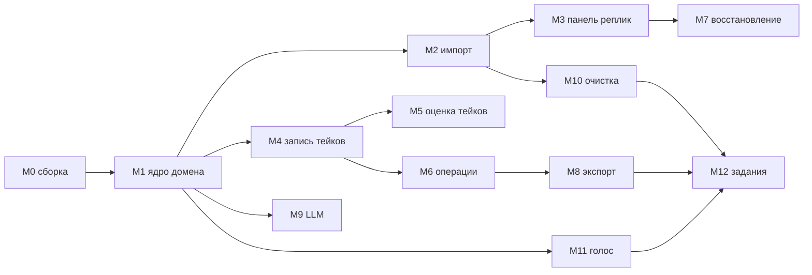

# ШАГ 3 — Roadmap RuDub Studio: модули (1 модуль = 1 PR = 1 ветка)

Дата: 2026-09-14. Основано на: `docs/analysis/audacity4_map.md` (ревизия 2),
`docs/plans/architecture.md` (ШАГ 2). Код не пишется до согласования этого
файла (AGENTS.md §2 п.6).

## 0. Правила исполнения

- Один модуль roadmap'а = одна ветка = один PR. Muse-модуль ≠ PR: несколько
  PR последовательно расширяют один muse-модуль (`src/dubbing`: M1→M2→M3→M8).
- Коммиты — conventional commits, описание на русском (AGENTS.md §5).
- Любое изменение состояния проекта — только через `IProjectHistory`
  (`pushHistoryState` / `startUserInteraction` / `endUserInteraction` /
  `modifyState(typeid(...))`); параллельный механизм отмены запрещён.
- Каждый PR содержит тест, доказывающий критерий готовности (ctest,
  `AU_BUILD_*_TESTS`). Без реального прогона модуль не считается готовым.
- Весь новый пользовательский текст — на русском.

## 1. Последовательность модулей



---

## M0. Подготовка сборочной машины (не PR — обязательный этап)

**Состав:** установка Qt 6.10 MSVC 2022 x64 (+ Network Auth, Shader Tools,
State Machines, Qt 5 Compatibility), CMake ≥ 3.24, Ninja, MSVC 2022;
конфигурация `audacity-debug` из [`CMakePresets.json`](../../CMakePresets.json);
первая сборка; прогон существующего тестового набора.

**Фактическая процедура (выполнена и зафиксирована 2026-09-14, AGENTS.md §9).**
Окружение: VS 18 BuildTools MSVC 14.50.35717 (cl 19.50), CMake 4.2.3-msvc3 и
Ninja из состава VS, Qt 6.10.1 msvc2022_64 (D:/Qt/6.10.1/msvc2022_64).
Важно: пресет `audacity-debug` (Debug) на этой машине НЕ собирается — muse_deps
использует prebuilt-пакеты только при RelWithDebInfo (дословно
`muse_deps/buildtools/resolve.cmake:460-461`: `if(NOT mode STREQUAL "rebuild" AND config STREQUAL "RelWithDebInfo")`),
а source-fallback падает на libpng (не находит ZLIB). Поэтому рабочий пресет —
`audacity-release` (RelWithDebInfo, отладочные PDB на MSVC сохраняются).

```
:: 1) Конфигурация (командная строка cmd из корня d:/auda/audacity)
call "C:\Program Files (x86)\Microsoft Visual Studio\18\BuildTools\VC\Auxiliary\Build\vcvars64.bat"
"C:\Program Files (x86)\Microsoft Visual Studio\18\BuildTools\Common7\IDE\CommonExtensions\Microsoft\CMake\CMake\bin\cmake.exe" --preset audacity-release -DCMAKE_PREFIX_PATH=D:/Qt/6.10.1/msvc2022_64

:: 2) Сборка
"C:\Program Files (x86)\Microsoft Visual Studio\18\BuildTools\Common7\IDE\CommonExtensions\Microsoft\CMake\CMake\bin\cmake.exe" --build build\audacity-release

:: 3) Тесты (PATH обязателен: Qt + все _deps\*\bin + wxwidgets-DLL)
powershell -NoProfile -Command "$root = 'd:/auda/audacity/build/audacity-release'; $bins = Get-ChildItem -Directory ($root + '/_deps') | ForEach-Object { Join-Path $_.FullName 'bin' } | Where-Object { Test-Path $_ }; $env:PATH = 'D:/Qt/6.10.1/msvc2022_64/bin;' + $root + '/_deps/wxwidgets/lib/vc_x64_dll;' + ($bins -join ';') + ';' + $env:PATH; & 'C:/Program Files (x86)/Microsoft Visual Studio/18/BuildTools/Common7/IDE/CommonExtensions/Microsoft/CMake/CMake/bin/ctest.exe' --test-dir $root --output-on-failure"
```

**Результат M0:** сборка успешна (3319 целей, `src/app/bin/Audacity4.exe`,
PortAudio+ASIO из исходников по REBUILD-флагу); ctest — **27/28 пройдено**.
Заранее красный (окружение, не наши изменения): `au_project_tests`, кейс
`Load_FileCannotBeOpened_ReturnsCantOpen` — тест создаёт read-protected файл
и ждёт ошибку открытия; на этой машине файл открывается успешно
(лог: `src/project/tests/audacityproject_tests.cpp:205` — Actual: true,
Expected: false; плюс `removeIfExists` не может удалить защищённые файлы).
Зафиксировано как известный красный тест апстрима на данной конфигурации.

**Критерий готовности:** приложение собирается и запускается на целевой
машине; ctest зелёный (или зафиксирован список заранее красных тестов
апстрима); процедура записана в этот файл. **Статус: ВЫПОЛНЕНО.**

---

## M1. Ядро домена дубляжа и тип проекта (§6.1)

**Muse-модуль:** `src/dubbing` (создаётся; `declare_module(dubbing)`;
регистрация в [`src/app/appfactory.cpp`](../../src/app/appfactory.cpp)).

**Затрагиваемые файлы/классы:**
- Новые: `src/dubbing/dubbingmodule.*`, `dom/{gamefile,scene,line,take}.h`,
  `idubbingproject.h`, `internal/dubbingproject.*`,
  `internal/dubbingprojectfileioextension.*` (реализация
  [`au3/libraries/au3-project-file-io/ProjectFileIOExtension.h`](../../au3/libraries/au3-project-file-io/ProjectFileIOExtension.h);
  запись через `ProjectSerializer::WriteBlob` —
  [`au3/libraries/au3-project-file-io/ProjectSerializer.h:61`](../../au3/libraries/au3-project-file-io/ProjectSerializer.h)),
  `internal/dubbingstateextension.*` (`: UndoStateExtension` +
  `UndoRedoExtensionRegistry::Entry` —
  [`au3/libraries/au3-project-history/UndoManager.h:84-131`](../../au3/libraries/au3-project-history/UndoManager.h)),
  `internal/dubbingserializer.*` (версионированный blob),
  `dubbingconfiguration.*` (настройки: паттерн WAV, порог сверки длительности),
  `tests/dubbingdomain_tests.cpp`.
- Расширения: [`src/project/types/projecttypes.h`](../../src/project/types/projecttypes.h)
  (`ProjectCreateOptions` + признак дубляжа),
  [`src/project/qml/Audacity/Project/NewProjectDialog.qml`](../../src/project/qml/Audacity/Project/NewProjectDialog.qml)
  + [`src/project/view/newprojectmodel.*`](../../src/project/view/newprojectmodel.h)
  (выбор типа «Обычный/Дубляж»), projectmeta (флаг типа), страница настроек
  Dubbing в `src/preferences`.

**Механизм отмены:** `DubbingStateExtension` в UndoStack au3; правки
метаданных — `pushHistoryState` / `modifyState(typeid(DubbingStateExtension))`
(дословно [`src/trackedit/iprojecthistory.h:44-51`](../../src/trackedit/iprojecthistory.h)).

**Сложность/риски:** средняя. Риски: формат blob (митигируется версией
схемы); взаимодействие `ProjectFileIOExtensionRegistry` с автосейвом
(проверить `OnUpdateSaved` при AutoSave — тестом).

**Критерий готовности (тест):** создать дубляж-проект → изменить RU-текст
реплики → undo/redo восстанавливает текст → сохранить → переоткрыть файл на
другой машине/пути → домен (дерево, тексты, статусы) идентичен; автосейв
создаёт снимок с данными дубляжа.

**Переиспользуется/расширяется/с нуля:** переиспользуются ProjectFileIO,
ProjectFileIOExtension-механика, UndoStack-расширения; расширяются project
(тип, диалог); с нуля — домен, сериализация, настройки.

## M2. Импорт JSON + массовый импорт WAV по guid (§6.2)

**Muse-модуль:** расширение `src/dubbing` (каталог `import/`).

**Затрагиваемые файлы/классы:**
- Новые: `import/dubbingjsonreader.*` (QJsonDocument, UTF-8; порядок ключей =
  порядок реплик), `import/dubbingimportservice.*` (сканирование папки
  рекурсивно, паттерн `{guid}.wav` из настроек, регистр нечувствителен;
  статусы; сверка `dur` с фактической длительностью через
  `Au3Importer::fileInfo`), `import/dubbingimportlog.*`, диалог импорта
  `qml/.../DubbingImportDialog.qml`, `tests/dubbingimport_tests.cpp`
  (фикстура: `docs/requirements/sample.json` + синтетические WAV).
- Переиспользование (без изменений): `Au3Importer::importIntoTrack` (дословно
  [`src/importexport/import/internal/au3/au3importer.h:35`](../../src/importexport/import/internal/au3/au3importer.h)),
  mod-pcm/libsndfile, `muse::Progress`.

**Механизм отмены:** один `pushHistoryState(«Импорт дубляжа»)` на пакет
(CONSOLIDATE); слияние метаданных — через `DubbingStateExtension`.

**Сложность/риски:** средняя-высокая (десятки тысяч файлов, отмена
большого пакета). Митигация: пакетная отмена одним состоянием; фоновый
поток + прогресс + лог; инкрементальность по guid.

**Критерий готовности (тест):** импорт sample.json + папки с N WAV:
дерево файлов/сцен/реплик построено, порядок реплик = порядку ключей JSON;
отсутствующий WAV → статус «нет референса», остальные импортированы;
расхождение длительности > порога → предупреждение в логе; повторный
импорт после правки двух текстов не затирает правки; undo возвращает
проект к состоянию до импорта.

**Переиспользуется/расширяется/с нуля:** переиспользуются однофайловый
импорт, JSON (Qt), прогресс; расширяется лог/статусы домена; с нуля —
сервис массового импорта, сверка, инкрементальность.

## M3. Панель списка реплик (§6.3)

**Muse-модуль:** расширение `src/dubbing` (каталог `panel/`).

**Затрагиваемые файлы/классы:**
- Новые: `panel/linesslistmodel.*` (QAbstractItemModel, виртуализация),
  `panel/linesfiltermodel.*`, `qml/.../LinesPanel.qml` (+внутренние:
  строки, фильтры, поиск), `panel/lineworkspacecontroller.*` (двойной клик:
  выбор референс-клипа, скролл таймлайна, открытие текста).
- Расширения: [`src/appshell/qml/Audacity/AppShell/ProjectPage/ProjectPage.qml`](../../src/appshell/qml/Audacity/AppShell/ProjectPage/ProjectPage.qml)
  — `DockPanel` в `panels: [...]` (точка регистрации, §0.2 architecture.md);
  [`src/appshell/qml/Audacity/AppShell/projectpagemodel.h`](../../src/appshell/qml/Audacity/AppShell/projectpagemodel.h)
  — `linesPanelName()`.

**Механизм отмены:** правка RU-текста из панели — `pushHistoryState`
(«Правка текста реплики»).

**Сложность/риски:** средняя. Риск — производительность на десятках тысяч
строк (митигация: виртуализация, фильтрация в прокси-модели, отложенный
поиск).

**Критерий готовности (тест):** панель с 30 000 реплик: скролл без лагов
(замер FPS/времени кадра), фильтры UNKNOWN/статус/расхождение/нет
референса, полнотекстовый поиск; двойной клик позиционирует референс и
открывает текст; правка текста отменяется Ctrl+Z.

**Переиспользуется/расширяется/с нуля:** переиспользуются Muse.Dock,
uicomponents, workspace; расширяются ProjectPage.qml/ProjectPageModel;
с нуля — модель, фильтры, рабочая зона реплики.

## M4. Запись: циклические тейки, locked-референс, мастер (§6.4)

**Muse-модули:** расширение `src/dubbing` (каталог `record/`) + правки
`src/record`, `src/trackedit`, `src/projectscene`.

**Затрагиваемые файлы/классы:**
- Новые: `record/dubbingrecordcontroller.*` (сценарий «дубль реплики»:
  каждый проход = новая дорожка-тейк `TAKE n`, границы = референс;
  monitor-переключатель; преднастройка моно),
  `record/dubbingrecorduiactions.*`.
- Расширения: [`src/trackedit/dom/track.h`](../../src/trackedit/dom/track.h)
  (`locked`), `src/trackedit/internal/trackeditinteraction.*` (гвард
  операций над locked: разрешены только mute/solo),
  [`src/trackedit/trackedittypes.h`](../../src/trackedit/trackedittypes.h),
  [`src/record/internal/recordcontroller.*`](../../src/record/internal/recordcontroller.h),
  `src/record/internal/recorduiactions.*`, хедер дорожки в
  `src/projectscene` (иконка замка), сохранение locked в домене (blob).

**Механизм отмены:** штатный undo записи (создание дорожки/клипа уже
обёрнуто в `pushHistoryState` внутри record/trackedit); создание take-дорожки
— `newMonoTrack` + push в контроллере дубляжа.

**Сложность/риски:** высокая. Риски: тайминги старт/стоп по границам
референса (митигация: lead-in/pending-механизм
[`src/record/internal/au3/au3record.cpp`](../../src/record/internal/au3/au3record.cpp)
переиспользуется); регресс штатной записи (гвард locked не должен трогать
обычные проекты — флаг по умолчанию false).

**Критерий готовности (тест):** дубляж-сессия: 3 прохода записи реплики →
3 отдельные дорожки-тейка, старые не удалены; попытка удалить/обрезать
референсную дорожку отклонена, mute/solo работает; мониторинг по умолчанию
выключен, включается из UI; частота проекта = заданная при создании;
undo убирает последний тейк.

**Переиспользуется/расширяется/с нуля:** переиспользуются PortAudio/ASIO,
au3record, undo; расширяются trackedit (locked), record (сценарий);
с нуля — контроллер дубляж-записи, конвенция мастер-дорожки.

## M5. Автооценка тейков (§6.5)

**Muse-модуль:** расширение `src/dubbing` (каталог `assessment/`).

**Затрагиваемые файлы/классы:** новые `assessment/takequalityservice.*`
(громкость/клиппинг/длительность; ядро расчётов —
[`au3/libraries/au3-wave-track-fft/`](../../au3/libraries/au3-wave-track-fft),
`FindClippingBase` —
[`au3/libraries/au3-builtin-effects/FindClippingBase.h`](../../au3/libraries/au3-builtin-effects/FindClippingBase.h),
meter — `src/au3wrap/internal/au3audiometer.*`), индикатор в панели реплик
(M3) и хедере тейка, `tests/takequality_tests.cpp` (синтетический клип с
клиппингом/тишиной).

**Механизм отмены:** ручная маркировка тейка — `pushHistoryState`
(метаданные).

**Сложность/риски:** низкая-средняя. Расчёт асинхронный, не блокирует
запись.

**Критерий готовности (тест):** после записи тейка индикатор отражает
клиппинг/тихий/длинный-короткий; маркировка «лучший» отменяется undo;
подсказка не блокирует компоновку.

**Переиспользуется/расширяется/с нуля:** переиспользуются FFT/meter/
FindClipping; с нуля — сервис метрик и индикаторы.

## M6. Операции редактирования дубляжа (§6.6)

**Muse-модули:** расширение `src/trackedit` + действия в `src/dubbing`.

**Затрагиваемые файлы/классы:**
- Расширения: [`src/trackedit/itrackeditinteraction.h`](../../src/trackedit/itrackeditinteraction.h)
  — новые методы `fitClipToReference`, `alignClipToReference`,
  `sendClipToMaster`; реализация
  `src/trackedit/internal/trackeditinteraction.*` (+ au3wrap
  `DomAccessor`/stretch — механизм `changeClipSpeed`,
  `stretchClipsLeft/Right`, `makeRoomForClip` уже есть в интерфейсе);
  [`src/trackedit/internal/trackedituiactions.*`](../../src/trackedit/internal/trackedituiactions.h)
  — действия «Подогнать под референс», «Выровнять по референсу»,
  «Отправить в мастер» (+ хоткеи), `tests/trackedit_dubbingops_tests.cpp`.

**Механизм отмены:** `pushHistoryState` с русским описанием внутри каждой
операции (как у `changeClipSpeed`).

**Сложность/риски:** средняя. Риск — качество стретча на коротких репликах
(митигация: использовать SBSMS-путь клипа, ограничить коэффициент,
предупреждение при |Δ| > 30%).

**Критерий готовности (тест):** клип 1.8 с подгоняется под референс 2.0 с
(итоговая длительность = 2.0 ± допуск, тон сохранён); выравнивание ставит
начало клипа точно в начало референса; «Отправить в мастер» переносит копию
на мастер-дорожку с кроссфейдом; каждая операция отменяется undo.

**Переиспользуется/расширяется/с нуля:** переиспользуются штатные
редактирование/эффекты/SBSMS; расширяется trackedit; с нуля — только
связка с доменом (guid ↔ ClipKey).

## M7. Надёжность: восстановление со временем снимка (§6.7)

**Muse-модуль:** расширение `src/project`.

**Затрагиваемые файлы/классы:**
[`src/project/internal/opensaveprojectscenario.*`](../../src/project/internal/opensaveprojectscenario.h),
стартовый экран проектов (`src/project/qml/.../ProjectsPage*`):
предложение «Обнаружена несохранённая сессия (снимок <дата-время>) —
восстановить?» на базе `IAu3Project::isRecovered()`/`hasAutosaveData`
([`src/au3wrap/iau3project.h`](../../src/au3wrap/iau3project.h)) + времени
файла снимка; `tests/recovery_tests.cpp`.

**Механизм отмены:** не требуется (поток восстановления, не правка).

**Сложность/риски:** низкая. Автосейв (5 мин, только при изменениях —
[`src/project/internal/projectconfiguration.cpp`](../../src/project/internal/projectconfiguration.cpp))
проверить тестом и не менять.

**Критерий готовности (тест):** убить процесс после автосейва → при старте
предложено восстановление с временем снимка → восстановление открывает
проект с данными дубляжа.

**Переиспользуется/расширяется/с нуля:** переиспользуются autosaver/isRecovered;
расширяется стартовый сценарий; с нуля — ничего.

## M8. Экспорт результата (§6.8)

**Muse-модуль:** расширение `src/dubbing` (каталог `export/`) + правка
`src/importexport/export`.

**Затрагиваемые файлы/классы:**
- Новые: `export/dubbingexportservice.*` (экспорт клипа/диапазона мастера в
  WAV/FLAC c явным именем `{guid}.wav`; пакетный экспорт по фильтру
  файл/сцена/спикер/статус; шаблон имени `{guid}/{file_id}/{quest_id}/
  {speaker}`), диалог пакетного экспорта, `tests/dubbingexport_tests.cpp`.
- Переиспользование: `IExporter::exportData` (дословно
  [`src/importexport/export/iexporter.h:43-44`](../../src/importexport/export/iexporter.h)).

**Механизм отмены:** экспорт не меняет аудио; статус «экспортировано» —
через `DubbingStateExtension` + `pushHistoryState`.

**Сложность/риски:** средняя. Риск — текущий экспорт завязан на выделение
(митигация: временная установка selection → exportData → восстановление).

**Критерий готовности (тест):** экспорт одной реплики создаёт
`{guid}.wav` с длительностью мастера ± допуск; пакет по фильтру «сцена +
статус=готово» создаёт файлы по шаблону; лог/прогресс; повторный экспорт
идемпотентен (перезапись).

**Переиспользуется/расширяется/с нуля:** переиспользуются экспортер,
форматы; с нуля — сервис имён/фильтров и пакетный слой. Опция «внешние
ссылки» (порог — §14 architecture.md) сюда не входит; отдельный модуль при
достижении порога.

## M9. LLM-адаптация текста (§6.9)

**Muse-модуль:** `src/dubbing_text` (создаётся).

**Затрагиваемые файлы/классы:** `dubbing_textmodule.*`, `illmprovider.h`,
`internal/openaiprovider.*` (приоритет), `internal/ollamaprovider.*`
(тот же интерфейс), `internal/llmrequestbuilder.*` (промпт с метаданными),
`textadaptationviewmodel.*`, панель `qml/.../TextAdaptationPanel.qml`
(EN/текущий RU/3 варианта + объяснения; слоги; оценка длительности;
первый/последний звук), `internal/syllablecounter.*`,
`internal/phoneticedge.*`, история версий (домен M1), настройки
провайдера (endpoint/auth/модель, без пересборки), `tests/llm_tests.cpp`
(мок-провайдер).

**Механизм отмены:** выбор варианта/правка текста — `pushHistoryState`;
история версий в домене, откат = выбор старой версии (тоже undo-операция).

**Сложность/риски:** средняя. Риски: качество промпта (итеративно),
лимиты API (только online — раздел 3), русская фонетика слогов/краёв
(эвристика + словарь).

**Критерий готовности (тест):** с мок-провайдером панель показывает 3
варианта с объяснениями, слоги и оценку длительности; выбор варианта
обновляет RU с возможностью undo; история версий отката работает;
переключение провайдера из настроек без пересборки (тест двух конфигураций).

**Переиспользуется/расширяется/с нуля:** переиспользуются muse network,
панели/настройки; с нуля — весь модуль.

## M10. AI-очистка голоса (§6.10)

**Muse-модуль:** `src/dubbing_cleanup` (создаётся).

**Затрагиваемые файлы/классы:** `dubbing_cleanupmodule.*`,
`icleanupengine.h`, `internal/pythonprocess.*` (QProcess; WAV-обмен во
временной папке; профили «слабый» CPU/RTX 4060 и «мощный» RTX 4080S —
§4.6 AGENTS.md), `cleanupchain.*` (шаги: шумоподавление/гул/свистящие —
каждый включаемый; штатные Noise Reduction / Click Removal программно через
`IEffectExecutionScenario::performEffect(effectId, params)` — дословно
[`src/effects/effects_base/ieffectexecutionscenario.h:23-24`](../../src/effects/effects_base/ieffectexecutionscenario.h)),
UI A/B «было/стало», настройки (путь Python, движки, профили),
`tests/cleanup_tests.cpp` (мок-процесс с фиксированным выводом).

**Механизм отмены:** apply цепочки — штатный path эффектов
(`pushHistoryState`); до подтверждения A/B проект не меняется.

**Сложность/риски:** средняя-высокая. Риски: внешнее Python-окружение
(развёртывается вручную, вне репозитория; версия/зависимости описать в
документации модуля), стабильность длинных прогонов (таймауты, перезапуск
только ошибок — в M12).

**Критерий готовности (тест):** с мок-движком цепочка «шумоподавление +
гул» применяется к тестовому тейку, A/B прослушивание работает, apply
отменяется undo; запись не блокируется во время фонового прогона.

**Переиспользуется/расширяется/с нуля:** переиспользуются штатные эффекты,
QProcess; с нуля — runner, профили, A/B, пакетный слой.

## M11. Голосовой сервис (§6.11)

**Muse-модуль:** `src/dubbing_voice` (создаётся).

**Затрагиваемые файлы/классы:** `dubbing_voicemodule.*`,
`ivoiceprovider.h` (endpoint + auth + модель из настроек; режимы
«голос-в-голос»/«текст-в-голос»), `internal/restprovider.*`,
`internal/voicecache.*` (ключ hash(текст+голос+параметры) → WAV; повтор
не тратит лимит), `internal/voicebudget.*` (остаток, блокировка при нуле,
предрасчёт перед batch), маппинг `speaker_internal` → голос (+ вариации:
шёпот) в домене/UI-панель «Голоса», `tests/voice_tests.cpp` (мок-API).

**Механизм отмены:** генерация = импорт сгенерированного WAV как нового
клипа (штатный undo импорта); маппинг — `DubbingStateExtension`.

**Сложность/риски:** средняя. Риски: конкретный API не зафиксирован
(§4.4) — интерфейс провайдера + настройка; лимиты (символы/кредиты)
уточняются при реализации.

**Критерий готовности (тест):** с мок-API: «текст-в-голос» создаёт клип
на take-дорожке реплики; повтор того же текста берётся из кэша (0 запросов);
нулевый остаток блокирует batch; предрасчёт расхода отображается до
запуска.

**Переиспользуется/расширяется/с нуля:** переиспользуются muse network,
импорт-путь; с нуля — провайдер, кэш, бюджет, маппинг.

## M12. Движок пакетной обработки (§6.12)

**Muse-модуль:** `src/dubbing_jobs` (создаётся).

**Затрагиваемые файлы/классы:** `dubbing_jobsmodule.*`,
`jobs/jobsengine.*` (область: проект/файл/сцена/спикер/выделенные;
цепочка: очистка → голосовой сервис → подгонка → экспорт; вызовы сервисов
M10/M11/M6/M8 по IOC), `jobs/jobsqueue.*` (сериализация очереди в blob
проекта — переживает перезапуск), панель «Задания»
(`jobsPanelName()` в ProjectPage.qml) с прогрессом/логом,
`tests/jobs_tests.cpp` (моки шагов).

**Механизм отмены:** шаги меняют проект только через механизмы M6/M8/M10;
состояние очереди — `modifyState(typeid(DubbingStateExtension))`.

**Сложность/риски:** высокая (координация четырёх подсистем). Митигация:
моки шагов в тестах, пошаговый лог, перезапуск только упавших.

**Критерий готовности (тест):** цепочка из 3 мок-шагов по фильтру «сцена»
выполняется, прогресс/лог отражаются; падение шага 2 реплики не валят
очередь; перезапуск приложения восстанавливает очередь и продолжает только
упавшие; предрасчёт расхода голосового сервиса показан до старта.

**Переиспользуется/расширяется/с нуля:** переиспользуются сервисы M6/M8/
M10/M11 и персистентность M1; с нуля — движок и панель.

---

## 2. Оценка размера .aup3 (реальный масштаб: 39 481 реплика, 2 181 сцена, 42 файла игры)

Формула с допущениями, расчёт и таблица — `docs/plans/architecture.md` §14.
Кратко: `V = N × (T̄ref × Bref + Ktake × Ttake × Btake + T̄master × Bmaster)`;
допущения: 48 кГц моно; референсы 24-bit (0.144 МБ/с), тейки 32-bit float
(0.192 МБ/с, 2 шт × 2.3 с), мастер 24-bit; T̄ref = 2.1 с по sample.json.
На реплику ≈ **1.49 МБ**; на весь масштаб ≈ **58.7 ГБ** — порог 15 ГБ
превышен почти в 4 раза → монолит «вся игра в одном .aup3» отклонён.

**Принятая стратегия (рекомендация, вопрос №2 в §4):** один дубляж-проект =
один файл игры (42 проекта): средний ≈ 1.4 ГБ, гипотеза максимума
(5 000 реплик) ≈ 7.4 ГБ — всё внутри .aup3, внешние ссылки не нужны.
Порог 15 ГБ остаётся жёстким лимитом на один .aup3 (внешние ссылки —
резерв на аномальный случай). Кэш voice/временные файлы очистки — вне .aup3.

## 3. Отложено: WEM-модуль (НЕ реализовывать)

- Приложение не конвертирует .wem ни в одну сторону; вход — готовые WAV,
  результат — WAV/lossless (раздел 3 AGENTS.md).
- Будущий опциональный пост-этап (только дизайн, без кода): приложение
  складывает финальные WAV пакетного экспорта (M8) в папку + манифест
  (guid, целевой формат, битрейт, каналы); конвертацию выполняет внешний
  инструмент (Wwise CLI / sound2wem / vgmstream-обёртка), запускаемый
  пользователем вручную.
- Зависимости vgmstream/Wwise CLI/sound2wem в кодовую базу не добавлять;
  в UI максимум — страница «Инструкция по конвертации».

## 4. Явные вопросы — РЕШЕНЫ (согласованы пользователем 2026-09-14; исходные формулировки сохранены для истории)

1. **Расширение файла дубляж-проекта: `.aup4` или `.aup3`?**
   Полная формулировка: в AU4 новые проекты по умолчанию сохраняются с
   расширением `.aup4` — дословно `src/project/types/projecttypes.h:297-299`
   (`AUP3 = "aup3"`, `AUP4 = "aup4"`, `AUP4UNSAVED = "aup4unsaved"`;
   функции `isAudacity3File`/`isAudacity4File`/`isAudacityFile` принимают
   оба). Контейнер один и тот же — SQLite с теми же таблицами; отличие
   только в суффиксе имени. Вопрос: сохранять новые дубляж-проекты как
   `.aup4` или принудительно `.aup3`?
   **Рекомендация: `.aup4`.** Обоснование: (а) это штатный путь AU4 —
   фильтры диалогов сохранения, recent files и определение типа уже
   настроены на `.aup4` для новых проектов, потребуется ноль правок кода;
   (б) `.aup3` в AU4 — ветка чтения легаси-проектов Audacity 3, добровольно
   маркировать новые проекты как легаси нет причин; (в) требование
   «открывается на другом ПК одним файлом» выполняется независимо от
   расширения. Если внешнему пайплайну (дампы/скрипты) принципиален
   `.aup3`, файл можно переименовать — контроль типа по суффиксу допускает
   оба, но без необходимости этого не делать.

2. **Стратегия хранения при реальном масштабе (монолит 58.7 ГБ против
   42 проектов).** Полная формулировка: расчёт на реальный масштаб
   (§2 здесь и §14 architecture.md) даёт ≈ 58.7 ГБ, если все 39 481 реплик
   42 файлов игры держать в одном .aup3 — порог 15 ГБ превышен почти
   в 4 раза; снижение битности не спасает (≈ 42 ГБ). Подтверждаете ли вы
   пересмотренную стратегию: **один дубляж-проект = один файл игры**
   (средний ≈ 1.4 ГБ, максимум по оценке ≈ 7.4 ГБ), все данные внутри
   .aup3, переносимость одним файлом — на уровне файла игры? Порог внешних
   ссылок 15 ГБ на один .aup3 остаётся жёстким лимитом; режим внешних
   ссылок — только резерв на аномальный случай (осознанно нарушает
   переносимость). Альтернативы: монолит 58.7 ГБ (не рекомендуется:
   время checkpoint/копирования, единая точка отказа) или внешние ссылки
   для всех референсов (нарушает требование раздела 3 AGENTS.md).

3. **Порядок AI-модулей: M9 (LLM) → M10 (очистка) → M11 (голос) → M12
   (задания)?** Полная формулировка: оставить предложенный порядок или
   поменять местами M9 и M11? **Рекомендация: оставить.** Обоснование:
   адаптация текста нужна до записи (вы читаете финальный RU), очистка
   применяется к вашим собственным записям — это основной поток работы,
   голосовой сервис — альтернатива самостоятельной записи и логически
   закрывает конвейер перед заданиями (M12 использует все три).

4. **Лимит голосового сервиса: символы или кредиты? Выбран ли конкретный
   сервис/API?** Полная формулировка: индикатор остатка лимита и
   предрасчёт расхода перед batch (M11) требуют знать, в чём измеряется
   лимит. Конкретный сервис в AGENTS.md §4.4 не зафиксирован (проектируется
   настраиваемый провайдер). **Рекомендация:** проектировать бюджет
   абстрактно — «единицы расхода» с настраиваемым типом (по умолчанию
   символы); уточнить при реализации M11. Если сервис уже выбран —
   назвать его и вид API (OpenAI-совместимый REST или свой), это влияет
   только на `internal/restprovider.*` в M11.

5. **Движки AI-очистки: DeepFilterNet (мощный профиль, RTX 4080S) +
   RNNoise (слабый профиль, CPU / RTX 4060)?** Полная формулировка:
   подтверждаете ли этот выбор пары движков (оба — внешние Python-пакеты,
   устанавливаются вручную вне репозитория; путь к venv-интерпретатору
   задаётся в настройках приложения)? **Рекомендация:** да, именно эту
   пару — RNNoise лёгкий и подходит для «слабого» профиля, DeepFilterNet
   заметно качественнее на тяжёлом шуме и использует GPU для «мощного».

6. **Согласование roadmap и снятие запрета на код.** Полная формулировка:
   подтверждаете ли вы roadmap в целом (после ответов на вопросы 1–5)
   как основу для работ, и разрешаете ли переход к M0 (настройка сборки
   на вашей машине, фиксация команды тестов) и затем M1 (ветка/PR ядра
   домена)? По AGENTS.md §2 п.6 запрет на код снимается только вашим
   явным сообщением — этот вопрос и есть запрос на него.

### Решения (пользователь, 2026-09-14)

1. **Расширение дубляж-проектов — `.aup4`.**
2. **Один дубляж-проект = один файл игры** (42 проекта); порог 15 ГБ
   на один файл — жёсткий лимит; внешние ссылки — только как резерв.
3. **Порядок M9 → M10 → M11 → M12 — оставить.**
4. **Бюджет голосового сервиса — абстрактные «единицы расхода»**
   (по умолчанию символы); конкретный API не фиксируется до M11.
5. **AI-очистка: DeepFilterNet (мощный) + RNNoise (слабый)**;
   Python venv разворачивается вручную, путь в настройках.
6. **Запрет на код (AGENTS.md §2 п.6) снят ЧАСТИЧНО:** разрешены только
   M0 (сборка, фиксация фактической команды ctest) и M1 (ядро домена,
   отдельная ветка). Остальные модули — без кода до отдельного
   согласования каждого.
